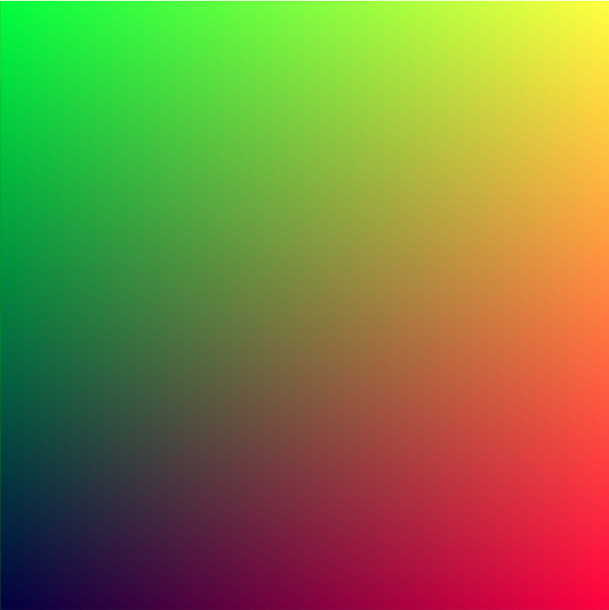

# Ray Tracing in One Weekend

https://raytracing.github.io/books/RayTracingInOneWeekend.html

手撸一个光线追踪器（Ray Tracer）

## 1. 概述

略。

## 2. 输出一张图像

### 2.1 PPM图像格式

开始渲染工作之前，需要有一种方式来查看你之后得到的渲染结果。

最直接的方式是将图像写入一个文件中。

有很多存储图像文件的方式，这里主要采用PPM格式，下面是它的维基介绍。


**【PPM介绍】**

**PPM（Portable PixMap）**是portable像素图片，由netpbm项目定义的一系列的portable图片格式中的一个。

这些图片格式**相对比较容易处理**，把每一个点的RGB分别保存下来（因此其没有压缩，导致文件较大），由于图片格式简单，一般作为图片处理的中间文件（不会丢失文件信息），或作为简单的图片格式保存。

**【PPM格式分析】**

netpbm几种图片格式通过其表示的颜色类型区分：

- PBM：位图，只有黑色和白色。
- PGM：灰度图。
- PPM：完整的RGB颜色。

PPM文件头由三部分组成：这几个部分之间用回车或换行分隔。

- 第一部分：**文件magic number**
    - 每一个netpbm图片由两个字节的magic number（ASCII）组成，用于识别**文件类型**（PBM/PGM/PPM）以及**文件编码**（ASCII/Binary）。
    - PPM格式的其实两个字节为**P3或P6**。
    - ASCII编码可读性好，可以直接打开读取其对应的图片的数据（比如RGB值），中间用空格回车隔开。
    - Binary格式的图片更快（不需要判断空格回车），图片尺寸较小，但可读性差。

- 第二部分：**图像宽度与高度**（空格隔开），用ASCII表示。
- 第三部分：**像素最大颜色组成**，允许描述超过一个字节（0-255）的颜色值。

在上述基础上，可以使用 `#` 进行注释，注释是 `#` 到行尾（回车或换行）部分。

`RayTracing.cpp`

```c++
#include "iostream"

int main(){

    // Image
    const int image_width = 256;
    const int image_height = 256;

    // Render
    std::cout << "P3\n" << image_width << " " << image_height << "\n255\n";

    for(int j = image_height - 1; j >= 0; --j) {
        for(int i = 0; i < image_width; ++i) {
            auto r = double(i) / (image_width - 1);
            auto g = double(j) / (image_height - 1);
            auto b = 0.25;

            int ir = static_cast<int>(255.999 * r);
            int ig = static_cast<int>(255.999 * g);
            int ib = static_cast<int>(255.999 * b);
            std::cout << ir << " " << ig << " " << ib << "\n";
        }
    }
    
    return 0;
}
```

注意点：

1. 像素从左到右，从上到下写。
2. 通常rgb的范围是[0, 1]，但之后需要将它们的范围扩展到[0, 255]

### 2.2 创建一个图像文件

可以使用**重定向命令**`>`将程序结果输出到文件中：

`shell命令`

```shell
mkdir build
cd build
cmake ..
make -j4

inOneWeekend > image.ppm
```

之后可以看到结果：



用文本处理打开`image.ppm`，可以看到如下内容：

```tex
P3
256 256
255
0 255 63
1 255 63
2 255 63
3 255 63
4 255 63
...
```

### 2.3 添加一个进度指标

添加一个**渲染进度输出**，用于提醒当前渲染的进度（同时避免陷入死循环）。

`RayTracing.cpp`

```c++
for(int j = image_height - 1; j >= 0; --j) {
    std::cerr << "\nScanlines remaining: " << j << " " << std::flush;
    for(int i = 0; i < image_width; ++i) {
        auto r = double(i) / (image_width - 1);
        auto g = double(j) / (image_height - 1);
        auto b = 0.25;

        int ir = static_cast<int>(255.999 * r);
        int ig = static_cast<int>(255.999 * g);
        int ib = static_cast<int>(255.999 * b);
        std::cout << ir << " " << ig << " " << ib << "\n";
    }
}

std::cerr << "\nDone.\n";
```

## 3. vec3 类

几乎所有的图形程序都有一些**存储向量和颜色的类**。

多数系统的向量是**4维**的（3维的齐次坐标，RGBA）。

本文主要用**3维**来进行处理颜色，坐标，方向，偏移等（主要为了减少代码量）。

### 3.1 变量与方法

`vec3.h`

```c++
#ifndef INONEWEEKEND_VEC3_H
#define INONEWEEKEND_VEC3_H

#include "cmath"
#include "iostream"

using std::sqrt;

class vec3 {
public:
    vec3(): e{0, 0, 0}{}
    vec3(double e0, double e1, double e2): e{e0, e1, e2} {}

    double x() const {return e[0];}
    double y() const {return e[1];}
    double z() const {return e[2];}

    vec3 operator -() const {return vec3(-e[0], -e[1], -e[2]);}
    double operator[](int i) const {return e[i];}
    double& operator[](int i) {return e[i];}

    vec3& operator += (const vec3 &v){
        e[0] += v.e[0];
        e[1] += v.e[1];
        e[2] += v.e[2];
        return *this;
    }

    vec3& operator *= (const double t){
        e[0] *= t;
        e[1] *= t;
        e[2] *= t;
        return *this;
    }

    vec3& operator /= (const double t){
        return *this *= 1 / t;
    }

    double length() const {
        return sqrt(lenth_squared());
    }

    double lenth_squared() const {
        return e[0] * e[0] + e[1] * e[1] + e[2] * e[2];
    }

public:
    double e[3];
};

// Type aliases for vec3
using point3 = vec3;    // 3D point
using color = vec3;     // RGB color

#endif //INONEWEEKEND_VEC3_H
```

### 3.2 vec3工具函数

`vec3.h`

```c++
// vec3 Utility Functions

inline std::ostream& operator<<(std::ostream &out, const vec3 &v) {
    return out << v.e[0] << " " << v.e[1] << " " << v.e[2];
}

inline vec3 operator+(const vec3 &u, const vec3 &v) {
    return vec3(u.e[0] + v.e[0], u.e[1] + v.e[1], u.e[2] + v.e[2]);
}

inline vec3 operator-(const vec3 &u, const vec3 &v) {
    return vec3(u.e[0] - v.e[0], u.e[1] - v.e[1], u.e[2] - v.e[2]);
}

inline vec3 operator*(const vec3 &u, const vec3 &v) {
    return vec3(u.e[0] * v.e[0], u.e[1] * v.e[1], u.e[2] * v.e[2]);
}

inline vec3 operator*(double t, const vec3 &v) {
    return vec3(t * v.e[0], t * v.e[1], t * v.e[2]);
}

inline vec3 operator*(const vec3 &v, double t) {
    return t * v;
}

inline vec3 operator/(vec3 v, double t) {
    return (1/t) * v;
}

inline double dot(const vec3 &u, const vec3 &v) {
    return u.e[0] * v.e[0] + u.e[1] * v.e[1] + u.e[2] * v.e[2];
}

inline vec3 cross(const vec3 &u, const vec3 &v) {
    return vec3(u.e[1] * v.e[2] - u.e[2] * v.e[1],
                u.e[2] * v.e[0] - u.e[0] * v.e[2],
                u.e[0] * v.e[1] - u.e[1] * v.e[0]);
}

inline vec3 unit_vector(vec3 v) {
    return v / v.length();
}
```

### 3.3 颜色工具函数

`color.h`

```c++
#ifndef INONEWEEKEND_COLOR_H
#define INONEWEEKEND_COLOR_H

#include "vec3.h"

#include "iostream"

void write_color(std::ostream &out, color pixel_color) {
    // Write the translated [0,255] value of each color component.
    out << static_cast<int>(255.999 * pixel_color.x()) << " "
        << static_cast<int>(255.999 * pixel_color.y()) << " "
        << static_cast<int>(255.999 * pixel_color.z()) << "\n";
}

#endif //INONEWEEKEND_COLOR_H
```

`main函数`中进行测试：

`RayTracing.cpp`

```c++
#include "color.h"
#include "vec3.h"

#include "iostream"

int main(){

    // Image
    const int image_width = 256;
    const int image_height = 256;

    // Render
    std::cout << "P3\n" << image_width << " " << image_height << "\n255\n";

    for(int j = image_height - 1; j >= 0; --j) {
        std::cerr << "\nScanlines remaining: " << j << " " << std::flush;
        for(int i = 0; i < image_width; ++i) {
            color pixel_color(double(i) / (image_width - 1), double(j) / (image_height - 1), 0.25);
            write_color(std::cout, pixel_color);
        }
    }

    std::cerr << "\nDone.\n";

    return 0;
}
```

## 4. 光线/简单摄像头/背景

### 4.1 光线类

所有的光线追踪都有一个**光线类**，同时沿着这根光线**计算所看到的颜色**。

光线函数：$P(t)=A+tb$，其中$P$是$t$时刻光线的3维位置，$A$是光线原点，$b$是光线方向。

当$t$的范围为$[-\infty, \infty]$时，可以选择这条三维直线上的任何位置。


函数$P(t)$可以通过`ray::at(t)`函数调用：

`ray.h`

```c++
#ifndef INONEWEEKEND_RAY_H
#define INONEWEEKEND_RAY_H

#include "vec3.h"

class ray {
public:
    ray(){}
    ray(const point3& origin, const vec3& direction): orig(origin), dir(direction){}

    point3 origin() const {return orig;}
    vec3 direction() const {return dir;}

    point3 at(double t) const {
        return orig + t * dir;
    }
    
public:
    point3 orig;
    point3 dir;
};

#endif //INONEWEEKEND_RAY_H
```

### 4.2 向场景中发出射线

射线穿过不同的像素，计算这些射线方向看到的颜色。

分为如下几个步骤：

1. 计算从摄像机到像素的射线。
2. 判断射线与哪个物体相交。
3. 计算交点的颜色。

注意：这里采用**长宽比16:9**（防止对方形的长宽搞混淆）。

摄像机放在$(0,0,0)$点，y轴在上，x轴在右，摄像机朝向z轴负方向（遵循**右手螺旋定则**）。

从上到下，从左到右遍历屏幕像素。


下面的代码中，光线`r`近似到像素中心（不用担心准确度，之后会进行反走样）

`RayTracing.cpp`

```c++
#include "color.h"
#include "vec3.h"
#include "ray.h"

#include "iostream"

color ray_color(const ray& r) {
    vec3 unit_direction = unit_vector(r.direction());
    auto t = 0.5 * (unit_direction.y() + 1.0);
    return (1.0 - t) * color(1.0, 1.0, 1.0) + t * color(0.5, 0.7, 1.0);
}

int main(){

    // Image
    const auto aspect_ratio = 16.0 / 9.0;
    const int image_width = 400;
    const int image_height = static_cast<int>(image_width / aspect_ratio);

    // Camera
    auto viewport_height = 2.0;
    auto viewport_width = aspect_ratio * viewport_height;
    auto focal_length = 1.0;

    auto origin = point3(0, 0, 0);
    auto horizontal = vec3(viewport_width, 0, 0);
    auto vertical = vec3(0, viewport_height, 0);
    auto lower_left_corner = origin - horizontal / 2 - vertical / 2 - vec3(0, 0, focal_length);


    // Render
    std::cout << "P3\n" << image_width << " " << image_height << "\n255\n";

    for(int j = image_height - 1; j >= 0; --j) {
        std::cerr << "\nScanlines remaining: " << j << " " << std::flush;
        for(int i = 0; i < image_width; ++i) {
            auto u = double(i) / (image_width - 1);
            auto v = double(j) / (image_height - 1);
            ray r(origin, lower_left_corner + u * horizontal + v * vertical - origin);
            color pixel_color = ray_color(r);
            write_color(std::cout, pixel_color);
        }
    }

    std::cerr << "\nDone.\n";

    return 0;
}
```

`ray_color(ray)`函数线性变化白色和蓝色（取决于y轴的高度，$-1.0<y<1.0$）。

这里有一个加权分配情况，当$t=1.0$时，显示白色，当$t=0.0$时，显示蓝色，中间是线性渐变。

$blendedValue=(1-t)\cdot startValue+t\cdot endValue$


## 5. 添加一个球体

通常使用一个球体来作为碰撞检测，因为比较容易计算。

### 5.1 光线与球体相交

球体公式：$x^2+y^2+z^2=R^2$

- 当$x^2+y^2+z^2=R^2$时，点$(x,y,z)$在球体表面上。
- 当$x^2+y^2+z^2<R^2$时，点$(x,y,z)$在球内。
- 当$x^2+y^2+z^2>R^2$时，点$(x,y,z)$在球外。

如果球心在$(C_x,C_y,C_z)$上，公式变为：$(x-C_x)^2+(y-C_y)^2+(z-C_z)^2=r^2$

从点$C=(C_x,C_y,C_z)$到点$P=(x,y,z)$的向量$(P-C)=(x-C_x, y-C_y, z-C_z)$

光线$P(t)=A+tb$与球体交点：$(P(t)-C)\cdot(P(t)-C)=(A+tb-C)\cdot(A+tb-C)=r^2$

对上式进行化简：$t^2b\cdot b+2tb\cdot(A-C)+(A-C)\cdot(A-C)-r^2=0$

其中只有$t$是未知量，一元二次方程，可以用求根公式计算，根的分布情况如下：


### 5.2 创建第一个光线追踪图像

在z轴-1的位置放置一个红色球体，测试光线是否能够打到球体。

`RayTracing.cpp`

```c++
bool hit_sphere(const point3& center, double radius, const ray& r){
    vec3 oc = r.origin() - center;
    auto a = dot(r.direction(), r.direction());
    auto b = 2.0 * dot(oc, r.direction());
    auto c = dot(oc, oc) - radius * radius;

    auto discriminant = b * b - 4 * a * c;

    return (discriminant > 0);
}

color ray_color(const ray& r) {
    if(hit_sphere(point3(0, 0, -1), 0.5, r)) return color(1, 0, 0);

    vec3 unit_direction = unit_vector(r.direction());
    auto t = 0.5 * (unit_direction.y() + 1.0);
    return (1.0 - t) * color(1.0, 1.0, 1.0) + t * color(0.5, 0.7, 1.0);
}
```

如果代码正确，可以得到如下结果：


此时还缺少一些东西（例如着色，反射光线，多个物体等）。

同时这里有个bug，就是如果把球体放在z轴的+1上，则会得到同样的结果，但是这是在你的后方，应该不显示才对，下面对其进行处理。

## 6. 表面法线和多物体

### 6.1 表面法线着色

首先，要获取表面法线，这样才能进行着色。

表面法线是一个与表面呈90度的向量。

**法线满足**：单位长度，方便后续着色。

- 对于一个球体，法线是球心与该点连线方向。


由于没有光源，因此采用**颜色图**来可视化法向量。

`RayTracing.cpp`

```c++
double hit_sphere(const point3& center, double radius, const ray& r){
    vec3 oc = r.origin() - center;
    auto a = dot(r.direction(), r.direction());
    auto b = 2.0 * dot(oc, r.direction());
    auto c = dot(oc, oc) - radius * radius;

    auto discriminant = b * b - 4 * a * c;

    if(discriminant < 0) {
        return -1.0;
    } else {
        return (-b - sqrt(discriminant)) / (2.0 * a);
    }
}

color ray_color(const ray& r) {
    auto t = hit_sphere(point3(0, 0, -1), 0.5, r);
    if(t > 0.0) {
        vec3 N = unit_vector(r.at(t) - vec3(0, 0, -1));
        return 0.5 * color(N.x() + 1, N.y() + 1, N.z() + 1);
    }

    vec3 unit_direction = unit_vector(r.direction());
    t = 0.5 * (unit_direction.y() + 1.0);
    return (1.0 - t) * color(1.0, 1.0, 1.0) + t * color(0.5, 0.7, 1.0);
}
```


### 6.2 简化光线相交代码

原来的：

`RayTracing.cpp`

```c++
double hit_sphere(const point3& center, double radius, const ray& r){
    vec3 oc = r.origin() - center;
    auto a = dot(r.direction(), r.direction());
    auto b = 2.0 * dot(oc, r.direction());
    auto c = dot(oc, oc) - radius * radius;

    auto discriminant = b * b - 4 * a * c;

    if(discriminant < 0) {
        return -1.0;
    } else {
        return (-b - sqrt(discriminant)) / (2.0 * a);
    }
}
```

两个优化：

- 向量自身点乘等于该向量模的平方，对$a$来说。
- 令$b=2h$，去掉系数。

$$
\frac{-b\pm\sqrt{b^2-4ac}}{2a}=\frac{-2h\pm\sqrt{(2h)^2-4ac}}{2a} =\frac{-2h\pm2\sqrt{h^2-ac}}{2a}=\frac{-h\pm\sqrt{h^2-ac}}{a} \tag{6.1}
$$

化简相交函数：

`RayTracing.cpp`

```c++
double hit_sphere(const point3& center, double radius, const ray& r){
    vec3 oc = r.origin() - center;
    auto a = r.direction().lenth_squared();
    auto half_b = dot(oc, r.direction());
    auto c = oc.lenth_squared() - radius * radius;
    auto discriminant = half_b * half_b - a * c;

    if(discriminant < 0) {
        return -1.0;
    } else {
        return (-half_b - sqrt(discriminant)) / a;
    }
}
```

### 6.3 碰撞物体抽象类

对于一些物体的碰撞，需要定义一个碰撞的抽象类。

**碰撞抽象类**中有一个碰撞函数`hit`，设定一个有效间隔$t_{min}$和$t_{max}$，当$t_{min}<t
<t_{max}$时，则发生碰撞。

`hittable.h`

```c++
#ifndef INONEWEEKEND_HITTABLE_H
#define INONEWEEKEND_HITTABLE_H

#include "ray.h"

struct hit_record{
    point3 p;
    vec3 normal;
    double t;
};

class hittable {
public:
    virtual bool hit(const ray& r, double t_min, double t_max, hit_record& rec) const = 0;
};

#endif //INONEWEEKEND_HITTABLE_H
```

创建一个球体类：

`sphere.h`

```c++
#ifndef INONEWEEKEND_SPHERE_H
#define INONEWEEKEND_SPHERE_H

#include "hittable.h"
#include "vec3.h"

class sphere: public hittable {
public:
    sphere(){}
    sphere(point3 cen, double r): center(cen), radius(r){};

    virtual bool hit(
            const ray& r, double t_min, double t_max, hit_record& rec)const override;

public:
    point3 center;
    double radius;
};

bool sphere::hit(const ray &r, double t_min, double t_max, hit_record &rec) const {
    vec3 oc = r.origin() - center;
    auto a = r.direction().lenth_squared();
    auto half_b = dot(oc, r.direction());
    auto c = oc.lenth_squared() - radius * radius;

    auto discriminant = half_b * half_b - a * c;
    if(discriminant < 0) return false;

    auto sqrtd = sqrt(discriminant);

    // Find the nearest root that lies in the acceptable range
    auto root = (-half_b - sqrtd) / a;
    if(root < t_min || root > t_max) {
        root = (-half_b + sqrtd) / a;
        if(root < t_min || root > t_max) {
            return false;
        }
    }

    rec.t = root;
    rec.p = r.at(rec.t);
    rec.normal = (rec.p - center) / radius;

    return true;
}

#endif //INONEWEEKEND_SPHERE_H
```

### 6.4 前表面 VS 后表面

需要判断光线与物体的交点，之后**光线朝物体内打还是物体外打**。


如果假定法向量总是指向物体外，之后需要**判断哪一边需要进行着色**。

可以计算光线与法向量的点积来确定哪一边：

- 如果光线与法向量在相同方向，则光线在物体内。
- 如果光线与法向量在相反方向，则光线在物体外。

可以**设置法向量总是指向表面外，或总是与入射光线相反**。

`hittable.h`

```c++
bool front_face;
if (dot(ray_direction, outward_normal) > 0.0) {
    // ray is inside the sphere
    normal = -outward_normal;
    front_face = false;
} else {
    // ray is outside the sphere
    normal = outward_normal;
    front_face = true;
}
```

在`hit_record`结构体中加入`front_fase`的判断：

`hittable.h`

```c++
struct hit_record{
    point3 p;
    vec3 normal;
    double t;
    bool front_face;

    inline void set_face_normal(const ray& r, const vec3& outward_normal) {
        front_face = dot(r.direction(), outward_normal) < 0;
        normal = front_face? outward_normal: -outward_normal;
    }
};
```

之后在`sphere::hit`函数中加入表面边判断：

`sphere.h`

```c++
bool sphere::hit(const ray& r, double t_min, double t_max, hit_record& rec) const {
    ...

    rec.t = root;
    rec.p = r.at(rec.t);
    vec3 outward_normal = (rec.p - center) / radius;
    rec.set_face_normal(r, outward_normal);

    return true;
}
```

### 6.5 碰撞物体列表

增加一个碰撞物体类：

`hittable_list.h`

```c++
#ifndef INONEWEEKEND_HITTABLE_LIST_H
#define INONEWEEKEND_HITTABLE_LIST_H

#include "hittable.h"

#include "memory"
#include "vector"

using std::shared_ptr;
using std::make_shared;

class hittable_list: public hittable {
public:
    hittable_list(){}
    hittable_list(shared_ptr<hittable> object) {add(object);}

    void clear() {objects.clear();}
    void add(shared_ptr<hittable> object) {objects.push_back(object);}

    virtual bool hit(const ray& r, double t_min, double t_max, hit_record& rec) const override;

public:
    std::vector<shared_ptr<hittable>> objects;
};

bool hittable_list::hit(const ray &r, double t_min, double t_max, hit_record &rec) const {
    hit_record temp_rec;
    bool hit_anything = false;
    auto closest_so_far = t_max;

    for(const auto& object: objects) {
        if(object->hit(r, t_min, closest_so_far, temp_rec)) {
            hit_anything = true;
            closest_so_far = temp_rec.t;
            rec = temp_rec;
        }
    }
    return hit_anything;
}

#endif //INONEWEEKEND_HITTABLE_LIST_H
```

### 6.6 一些新的C++特性

`shared_ptr<type>`是**智能指针**，用一个引用计数来定义。

- 每次将它的值指向另一个共享指针，则它的引用数会加1
- 当共享指针结束它的生命周期，则引用数会减1

一旦引用数变为0，则对象被删除。

**智能指针初始化：**

```c++
shared_ptr<double> double_ptr = make_shared<double>(0.37);
shared_ptr<vec3>   vec3_ptr   = make_shared<vec3>(1.414214, 2.718281, 1.618034);
shared_ptr<sphere> sphere_ptr = make_shared<sphere>(point3(0,0,0), 1.0);
```

`make_shared<thing>(thing_constructor_params ...)`使用构造参数定义`thing`实例，返回一个`shared_ptr<thing>`。

由于类别可以被**return类型自动判断**，因此可以用`auto`简写：

```c++
auto double_ptr = make_shared<double>(0.37);
auto vec3_ptr   = make_shared<vec3>(1.414214, 2.718281, 1.618034);
auto sphere_ptr = make_shared<sphere>(point3(0,0,0), 1.0);
```

本文中会使用大量的智能指针，因为它可以**允许多个物体共享一个实例**（例如多个球体共享一个纹理），同时它也可以自动化方便管理内存。

`std::shared_ptr`在`<memory>`头文件中。

### 6.7 常量及工具函数

一些**数学常量**：

`rtweekend.h`

```c++
#ifndef INONEWEEKEND_RTWEEKEND_H
#define INONEWEEKEND_RTWEEKEND_H

#include "cmath"
#include "limits"
#include "memory"

// Usings
using std::shared_ptr;
using std::make_shared;
using std::sqrt;

// Constants
const double infinity = std::numeric_limits<double>::infinity();
const double pi = acos(-1.0);

// Utility Functions
inline double degrees_to_radians(double degrees) {
    return degrees * pi / 180.0;
}

// Common Headers
#include "ray.h"
#include "vec3.h"

#endif //INONEWEEKEND_RTWEEKEND_H
```

修改`main函数`：

`RayTracing.cpp`

```c++
#include "rtweekend.h"

#include "color.h"
#include "hittable_list.h"
#include "sphere.h"

#include "iostream"

color ray_color(const ray& r, const hittable& world) {
    hit_record rec;

    if(world.hit(r, 0, infinity, rec)) {
        return 0.5 * (rec.normal + color(1, 1, 1));
    }

    vec3 unit_direction = unit_vector(r.direction());
    auto t = 0.5 * (unit_direction.y() + 1.0);
    return (1.0 - t) * color(1.0, 1.0, 1.0) + t * color(0.5, 0.7, 1.0);
}

int main(){

    // Image
    const auto aspect_ratio = 16.0 / 9.0;
    const int image_width = 400;
    const int image_height = static_cast<int>(image_width / aspect_ratio);

    // World
    hittable_list world;
    world.add(make_shared<sphere>(point3(0, 0, -1), 0.5));
    world.add(make_shared<sphere>(point3(0, -100.5, -1), 100));

    // Camera
    auto viewport_height = 2.0;
    auto viewport_width = aspect_ratio * viewport_height;
    auto focal_length = 1.0;

    auto origin = point3(0, 0, 0);
    auto horizontal = vec3(viewport_width, 0, 0);
    auto vertical = vec3(0, viewport_height, 0);
    auto lower_left_corner = origin - horizontal / 2 - vertical / 2 - vec3(0, 0, focal_length);


    // Render
    std::cout << "P3\n" << image_width << " " << image_height << "\n255\n";

    for(int j = image_height - 1; j >= 0; --j) {
        std::cerr << "\nScanlines remaining: " << j << " " << std::flush;
        for(int i = 0; i < image_width; ++i) {
            auto u = double(i) / (image_width - 1);
            auto v = double(j) / (image_height - 1);
            ray r(origin, lower_left_corner + u * horizontal + v * vertical - origin);
            color pixel_color = ray_color(r, world);
            write_color(std::cout, pixel_color);
        }
    }

    std::cerr << "\nDone.\n";

    return 0;
}
```


## 7. 反走样

当真实的摄像机拍一张照片，通常在边缘没有锯齿，因为**边缘像素是前景与背景的混合**。

我们可以将一簇像素值进行平均来得到相似的结果。

### 7.1 一些随机数工具

使用`<cstdlib>`头文件中的`rand()`函数来进行随机生成，这个函数返回`[0, RAND_MAX]`之间的任意值，这里我们返回`[0,1)`或`[MIN,MAX)`之间的值。

在`rtweekend.h`中加入如下代码：

`rtweekend.h`

```c++
#include "cstdlib"
...
    
// Utility Functions
...
    
inline double random_double() {
    // Returns a random real in [0, 1)
    return rand() / (RAND_MAX + 1.0);
}

inline double random_double(double MIN, double MAX{
    // Returns a random real in [min, max)
    return MIN + (MAX - MIN) * random_double();
}
```

C++旧版本一个标准的随机数生成器，但是新版本中`<random>`头文件解决了这个问题。

`rtweekend.h`

```c++
#include "random"
...
    
// Utility Functions
...

inline double random_double() {
    // Returns a random real in [0, 1)
    static std::uniform_real_distribution<double> distribution(0.0, 1.0);
    static std::mt19937 generator;

    return distribution(generator);
}

inline double random_double(double MIN, double MAX){
    // Returns a random real in [min, max)
    return MIN + (MAX - MIN) * random_double();
}
```

### 7.2 多次采样形成像素

在一个给定的像素里进行多次采样，在每个采样点发射光线，之后将这些光线平均：


新建一个`camera`类，管理虚拟摄像机以及相关场景的扫描任务：

`camera.h`

```c++
#ifndef INONEWEEKEND_CAMERA_H
#define INONEWEEKEND_CAMERA_H

#include "rtweekend.h"

class camera {
public:
    camera() {
        auto aspect_ratio = 16.0 / 9.0;
        auto viewport_height = 2.0;
        auto viewport_width = aspect_ratio * viewport_height;
        auto focal_length = 1.0;

        origin = point3(0, 0, 0);
        horizontal = vec3(viewport_width, 0.0, 0.0);
        vertical = vec3(0.0, viewport_height, 0.0);
        lower_left_corner = origin - horizontal / 2 - vertical / 2 - vec3(0, 0, focal_length);
    }

    ray get_ray(double u, double v) const {
        return ray(origin, lower_left_corner + u * horizontal + v * vertical - origin);
    }

private:
    point3 origin;
    point3 lower_left_corner;
    vec3 horizontal;
    vec3 vertical;
};

#endif //INONEWEEKEND_CAMERA_H
```

为了处理多个采样的颜色计算，需要更新`color.h`中的`write_color`函数，需要除以采样数`samples_per_pixel`，另外需要在`rtweenkend.h`中添加一个`clamp(x,MIN,MAX)`函数，将`x`的值固定在`[MIN,MAX]`之间。

`rtweekend.h`

```c++
inline double clamp(double x, double MIN, double MAX) {
    if(x < MIN) return MIN;
    if(x > MAX) return MAX;
    return x;
}
```

`color.h`

```c++
#ifndef INONEWEEKEND_COLOR_H
#define INONEWEEKEND_COLOR_H

#include "vec3.h"

#include "iostream"

void write_color(std::ostream &out, color pixel_color, int samples_per_pixel) {
    auto r = pixel_color.x();
    auto g = pixel_color.y();
    auto b = pixel_color.z();

    // Divide the color by the number of samples.
    auto scale = 1.0 / samples_per_pixel;
    r *= scale;
    g *= scale;
    b *= scale;

    // Write the translated [0,255] value of each color component.
    out << static_cast<int>(256 * clamp(r, 0.0, 0.999)) << " "
        << static_cast<int>(256 * clamp(g, 0.0, 0.999)) << " "
        << static_cast<int>(256 * clamp(b, 0.0, 0.999)) << "\n";
}

#endif //INONEWEEKEND_COLOR_H
```

同时需要修改`main函数`：

`RayTracing.cpp`

```c++
#include "rtweekend.h"

#include "color.h"
#include "hittable_list.h"
#include "sphere.h"
#include "camera.h"

#include "iostream"

color ray_color(const ray& r, const hittable& world) {
    hit_record rec;

    if(world.hit(r, 0, infinity, rec)) {
        return 0.5 * (rec.normal + color(1, 1, 1));
    }

    vec3 unit_direction = unit_vector(r.direction());
    auto t = 0.5 * (unit_direction.y() + 1.0);
    return (1.0 - t) * color(1.0, 1.0, 1.0) + t * color(0.5, 0.7, 1.0);
}

int main(){

    // Image
    const auto aspect_ratio = 16.0 / 9.0;
    const int image_width = 400;
    const int image_height = static_cast<int>(image_width / aspect_ratio);
    const int samples_per_pixel = 100;

    // World
    hittable_list world;
    world.add(make_shared<sphere>(point3(0, 0, -1), 0.5));
    world.add(make_shared<sphere>(point3(0, -100.5, -1), 100));

    // Camera
    camera cam;

    // Render
    std::cout << "P3\n" << image_width << " " << image_height << "\n255\n";

    for(int j = image_height - 1; j >= 0; --j) {
        std::cerr << "\nScanlines remaining: " << j << " " << std::flush;
        for(int i = 0; i < image_width; ++i) {
            color pixel_color(0, 0, 0);
            for(int s = 0; s < samples_per_pixel; ++s) {
                auto u = (i + random_double()) / (image_width - 1);
                auto v = (j + random_double()) / (image_height - 1);
                ray r = cam.get_ray(u, v);
                pixel_color += ray_color(r, world);
            }
            write_color(std::cout, pixel_color, samples_per_pixel);
        }
    }

    std::cerr << "\nDone.\n";

    return 0;
}
```

之后可以看到反走样的效果：


## 8. 漫反射材质

可以加上一些具有真实感的材质（漫反射材质matte暗淡的）。

有一个问题是我们是否需要将几何物体与材质进行配对（例如指定多个球体为同一种材质或一个球体有多种材质）。

### 8.1 一个简单的漫反射材质

漫反射物体自身不发出光，但它们会用自带的颜色来对环境光的颜色进行调节。

光线在漫反射表面进行随机反射。


它们也有可能被吸收而不是反射，表面越黑，则吸收的光越多。

在表面的点$p$有两个单位球与它相切，其中心点分别为$(P+n)$和$(P-n)$，其中$n$是平面法线。

单位球$(P-n)$认为在表面内部，单位球$(P+n)$认为在表面外部。

选择与光线源点在同一边的单位球，之后随机确定点$S$在单位球内，同时发射一条从$P$到$S$的光线。


这里需要一个算法来确定一个单位球内的随机点，采用最简单的算法：拒绝方法。

- 随机选择一个单位立方体的点，即$x,y,z\in[-1,1]$。
- 判断该点是否在单位球内，如果不在则拒绝该点。

`vec3.h`

```c++
class vec3 {
  public:
    ...
    inline static vec3 random() {
        return vec3(random_double(), random_double(), random_double());
    }

    inline static vec3 random(double min, double max) {
        return vec3(random_double(min,max), random_double(min,max), random_double(min,max));
    }
```

`vec3.h`

```c++
vec3 random_in_unit_sphere() {
    while(true){
        auto p = vec3::random(-1, 1);
        if(p.lenth_squared() >= 1) continue;
        return p;
    }
}
```

之后更新`ray_color()`函数来使用一个新的随机方向生成：

`RayTracing.cpp`

```c++
color ray_color(const ray& r, const hittable& world) {
    hit_record rec;

    if(world.hit(r, 0, infinity, rec)) {
        point3 target = rec.p + rec.normal + random_in_unit_sphere();
        return 0.5 * ray_color(ray(rec.p, target - rec.p), world);
    }

    vec3 unit_direction = unit_vector(r.direction());
    auto t = 0.5 * (unit_direction.y() + 1.0);
    return (1.0 - t) * color(1.0, 1.0, 1.0) + t * color(0.5, 0.7, 1.0);
}
```

### 8.2 限制光线递归的数量

这里有一个潜在的问题就是`ray_color`是一个递归的函数，它的递归边界是光线无法打到任何东西，但这个概率很小，因此可能会耗费很长时间同时造成栈溢出。

为了防止上述情况的发生，需要设置一个最大递归深度。

`RayTracing.cpp`

```c++
color ray_color(const ray& r, const hittable& world, int depth) {
    hit_record rec;

    // If we've exceeded the ray bounce limit, no more light is gathered
    if(depth <= 0) return color(0, 0, 0);

    if(world.hit(r, 0, infinity, rec)) {
        point3 target = rec.p + rec.normal + random_in_unit_sphere();
        return 0.5 * ray_color(ray(rec.p, target - rec.p), world, depth - 1);
    }

    vec3 unit_direction = unit_vector(r.direction());
    auto t = 0.5 * (unit_direction.y() + 1.0);
    return (1.0 - t) * color(1.0, 1.0, 1.0) + t * color(0.5, 0.7, 1.0);
}

...

int main(){

    // Image
    const auto aspect_ratio = 16.0 / 9.0;
    const int image_width = 400;
    const int image_height = static_cast<int>(image_width / aspect_ratio);
    const int samples_per_pixel = 100;
    const int max_depth = 50;
	
	... 
	
	// Render
    std::cout << "P3\n" << image_width << " " << image_height << "\n255\n";

    for(int j = image_height - 1; j >= 0; --j) {
        std::cerr << "\nScanlines remaining: " << j << " " << std::flush;
        for(int i = 0; i < image_width; ++i) {
            color pixel_color(0, 0, 0);
            for(int s = 0; s < samples_per_pixel; ++s) {
                auto u = (i + random_double()) / (image_width - 1);
                auto v = (j + random_double()) / (image_height - 1);
                ray r = cam.get_ray(u, v);
                pixel_color += ray_color(r, world, max_depth);
            }
            write_color(std::cout, pixel_color, samples_per_pixel);
        }
    }

    std::cerr << "\nDone.\n";

    return 0;
}
```

之后可以得到渲染的漫反射球体：


### 8.3 对颜色强度进行Gamma校正

注意到球体的阴影，这张照片很黑，但是我们的球体在光线bounce的时候只吸收一半的能量，另外一半会被反射。因此这些球体应该看起来很亮才对。

主要的原因是几乎所有的图片查看器（image viewers）都假定图片进行了gamma校正，即$[0,1]$的值在作为一个字节存储前都进行了一些变换。

在本例中，可以使用`gamma 2`来增加$\frac{1}{gamma}$，即做一次求根操作。

>**【Gamma校正】**
>
>【背景】
>
>在显示器中，**显像管**发生的电子束及其生成的图像亮度并不是随显像管的输入电压线性变化，电子流与输入电压相比按照**指数曲线变化**，**输入电压的指数大于电子束的指数**，这说明暗区的信号要比实际情况更暗，而亮区要比实际情况更高。
>
>要想重现摄像机拍摄的画面，显示器必须进行gamma校正，其目的是使摄像机根据入射光亮度与显像管的亮度对称而产生的输出信号，需要对图像信号引入一个相反的非线性失真，即与显示器的gamma曲线对应的摄像机gamma曲线，它的值应为$\frac{1}{\gamma}$，称为摄像机的gamma值。
>
>- 例如：电视的gamma值约为$2.2$，因此电视的摄像机非线性补偿gamma值为$\frac{1}{2.2}=0.45$。
>
>【定义】
>
>**伽玛校正（Gamma Correction）**：对图像的伽玛曲线进行编辑，以对其进行非线性色调编辑的方法，检出图像信号中的深色部分和浅色部分，并使两者比例增大，从而提高图像对比度效果。
>
>计算机绘图领域惯以此屏幕输出电压与对应亮度的转换关系曲线，称为**伽玛曲线（Gamma Curve）**。
>
>以传统**CRT（Cathode Ray Tube）**屏幕的特性而言，该曲线通常是一个乘幂函数，$Y=(X+e)\gamma$，其中，$Y$为亮度、$X$为输出电压、$e$为补偿系数、乘幂值$\gamma$为伽玛值，改变乘幂 值$\gamma$的大小，就能改变CRT的伽玛曲线。
>
>【原理】
>
>假设图像中有一个像素，值是200，那么对这个像素进行校正需要执行如下步骤：
>
>1. 【归一化】将像素值转换为$[0,1]$之间的实数。算法如下：$(i+0.5)/256$，这里包含$1$个除法和$1$个加法操作，对于像素 A 而言 , 其对应的归一化值为$0.783203$。
>2. 【预补偿】求出像素归一化后的数据以 $\frac{1}{\gamma}$ 为指数的对应值。若$\gamma=2/2$，则 $\frac{1}{\gamma}=0.454545$，对归一化后的A值进行预补偿的结果：$0.783203^{0.454545}=0.894872$ 。
>3. 【反归一化】经过预补偿的实数值反变换为$[0,255]$之间的整数值。算法为：$f*256-0.5$，此步骤包含$1$个乘法和$1$个减法运算。将A的预补偿结果$0. 894872$代入上式，得到A预补偿后对应的像素值为$228$，该值就是最后送入显示器的数据。 
>
>如果直接按公式编程，假设图像的分辨率为$800\times600$ ，对它进行gamma校正，需要执行48 万个浮点数乘法、除法和指数运算。效率过低，无法达到实时的效果。 
>
>因此有一种快速算法，如果能够确知图像的像素取值范围，例如，$[0,255]$之间的整数，则图像中任何一个像素值只能是$[0,255]$这$256$个整数中的某一个；在 gamma 值已知的情况下，$[0,255]$之间的任一整数，经过**归一化、预补偿、反归一化**操作后，所对应的结果是唯一的，也落在$[0,255]$这个范围内。
>
>如前例，已知 gamma 值为$2.2$，像素A的原始值是 $200$，可求得经 gamma 校正后A对应的预补偿值为$228$。基于上述原理，只需为$[0,255]$之间的每个整数执行一次预补偿操作，将其对应的预补偿值存入一个预先建立的 **gamma 校正查找表 (LUT:Look Up Table)** ，就可以使用该表对任何像素值在$[0,255]$之间的图像进行gamma校正。

`color.h`

```c++
void write_color(std::ostream &out, color pixel_color, int samples_per_pixel) {
    auto r = pixel_color.x();
    auto g = pixel_color.y();
    auto b = pixel_color.z();

    // Divide the color by the number of samples.
    auto scale = 1.0 / samples_per_pixel;
    r = sqrt(scale * r);
    g = sqrt(scale * g);
    b = sqrt(scale * b);

    // Write the translated [0,255] value of each color component.
    out << static_cast<int>(256 * clamp(r, 0.0, 0.999)) << " "
        << static_cast<int>(256 * clamp(g, 0.0, 0.999)) << " "
        << static_cast<int>(256 * clamp(b, 0.0, 0.999)) << "\n";
}
```

之后会得到稍微暗一些的图：


### 8.4 修复阴影痤疮

有些物体反射的光线会在$t=0$时再次击中自己，由于精度原因，值可能是$t=-0.0000001$或$t=0.0000001$等接近于$0$的浮点数，因此需要忽略掉$0$附近的一部分范围，防止物体发出的光线再次与自己相交。

`RayTracing.cpp`

```c++
color ray_color(const ray& r, const hittable& world, int depth) {
    hit_record rec;

    // If we've exceeded the ray bounce limit, no more light is gathered
    if(depth <= 0) return color(0, 0, 0);

    if(world.hit(r, 0.001, infinity, rec)) {	// change
        point3 target = rec.p + rec.normal + random_in_unit_sphere();
        return 0.5 * ray_color(ray(rec.p, target - rec.p), world, depth - 1);
    }

    vec3 unit_direction = unit_vector(r.direction());
    auto t = 0.5 * (unit_direction.y() + 1.0);
    return (1.0 - t) * color(1.0, 1.0, 1.0) + t * color(0.5, 0.7, 1.0);
}
```

### 8.5 真正的Lambertian反射

拒绝法生成的点的是单位球体积内的随机点，这样生成的向量大概率上会和法线方向相近，并且**极小概率**会沿着反射方向反射回去。

这个分布律的表达式有一个$\cos^3(\phi)$系数，其中$\phi$是反射光线距离法向量的夹角，这样当一个光线从一个离表面很小的角度射入时，也会散射到一片很大的区域，对最终颜色值的影响也会更低。

但是真正的Lambertian反射的系数是$\cos(\phi)$，它与光线靠近法向量的可能性更高，分布会更加平衡。

实现是通过随机选择单位球表面的一个点，之后通过正则化。

`vec3.h`

```c++
vec3 random_unit_vector() {
    return unit_vector(random_in_unit_sphere());
}
```


之后在main函数中进行更改：

`RayTracing.cpp`

```c++
color ray_color(const ray& r, const hittable& world, int depth) {
    hit_record rec;

    // If we've exceeded the ray bounce limit, no more light is gathered
    if(depth <= 0) return color(0, 0, 0);

    if(world.hit(r, 0.001, infinity, rec)) {
        point3 target = rec.p + rec.normal + random_unit_vector();
        return 0.5 * ray_color(ray(rec.p, target - rec.p), world, depth - 1);
    }

    vec3 unit_direction = unit_vector(r.direction());
    auto t = 0.5 * (unit_direction.y() + 1.0);
    return (1.0 - t) * color(1.0, 1.0, 1.0) + t * color(0.5, 0.7, 1.0);
}
```

之后渲染会得到一个近似的图片：


这与之前有两个不同：

- 变换后阴影减少了
- 两个球体相比较之前更亮

这些改变是因为光线得到了更多的均匀散射，更少的光线朝向法线进行散射。

这对于漫反射物体，它们会表现地更亮，因为有更多的光线被反弹到了摄像机。

### 8.6 一个可选的漫反射公式

多数早期的光线追踪论文会采用下面这种漫反射方法：

`vec3.h`

```c++
vec3 random_in_hemisphere(const vec3& normal) {
    vec3 in_unity_sphere = random_in_unit_sphere();

    // In the same hemisphere as the normal
    if(dot(in_unity_sphere, normal) > 0.0) return in_unity_sphere;
    else return -in_unity_sphere;
}
```

修改main函数：

`RayTracing.cpp`

```c++
color ray_color(const ray& r, const hittable& world, int depth) {
    hit_record rec;

    // If we've exceeded the ray bounce limit, no more light is gathered
    if(depth <= 0) return color(0, 0, 0);

    if(world.hit(r, 0.001, infinity, rec)) {
        point3 target = rec.p + random_in_hemisphere(rec.normal);
        return 0.5 * ray_color(ray(rec.p, target - rec.p), world, depth - 1);
    }

    vec3 unit_direction = unit_vector(r.direction());
    auto t = 0.5 * (unit_direction.y() + 1.0);
    return (1.0 - t) * color(1.0, 1.0, 1.0) + t * color(0.5, 0.7, 1.0);
}
```

得到结果：


## 9. 金属材质

### 9.1 材质抽象类

如果想让不同的物体有不同的材质，需要在设计上进行抉择。

可以设计一个通用的材质，这个材质里有很多参数和类型可供选择。

设计一个抽象类进行封装，对于一个材质需要有两个内容：

- 产生一个散射光线（或者称吸收多少入射光）
- 如果发生散射，决定光线会变暗多少

`material.h`

```c++
#ifndef INONEWEEKEND_MATERIAL_H
#define INONEWEEKEND_MATERIAL_H

#include "rtweekend.h"

struct hit_record;

class material {
public:
    virtual bool scatter(const ray& r_in, const hit_record& rec,
                         color& attenuation, ray& scattered) const = 0;
};

#endif //INONEWEEKEND_MATERIAL_H
```

### 9.2 描述光线与物体相交的数据结构

函数中使用`hit_record`作为参数可以传入多个变量。

`hittable.h`

```c++
#ifndef INONEWEEKEND_HITTABLE_H
#define INONEWEEKEND_HITTABLE_H

#include "ray.h"
#include "rtweekend.h"

class material;

struct hit_record{
    point3 p;
    vec3 normal;
    shared_ptr<material> mat_ptr;
    double t;
    bool front_face;

    inline void set_face_normal(const ray& r, const vec3& outward_normal) {
        front_face = dot(r.direction(), outward_normal) < 0;
        normal = front_face? outward_normal: -outward_normal;
    }
};

class hittable {
public:
    virtual bool hit(const ray& r, double t_min, double t_max, hit_record& rec) const = 0;
};

#endif //INONEWEEKEND_HITTABLE_H
```

上面这样设置使得材质可以告诉我们光线如何与表面进行交互。

之后需要设置球体类`sphere.h`来返回`hit_record`：

`sphere.h`

```c++
#ifndef INONEWEEKEND_SPHERE_H
#define INONEWEEKEND_SPHERE_H

#include <utility>

#include "hittable.h"
#include "vec3.h"

class sphere: public hittable {
public:
    sphere(){}
    sphere(point3 cen, double r, shared_ptr<material> m): center(cen), radius(r), mat_ptr(std::move(m)){};

    virtual bool hit(
            const ray& r, double t_min, double t_max, hit_record& rec)const override;

public:
    point3 center;
    double radius;
    shared_ptr<material> mat_ptr;
};

bool sphere::hit(const ray &r, double t_min, double t_max, hit_record &rec) const {
    vec3 oc = r.origin() - center;
    auto a = r.direction().lenth_squared();
    auto half_b = dot(oc, r.direction());
    auto c = oc.lenth_squared() - radius * radius;

    auto discriminant = half_b * half_b - a * c;
    if(discriminant < 0) return false;

    auto sqrtd = sqrt(discriminant);

    // Find the nearest root that lies in the acceptable range
    auto root = (-half_b - sqrtd) / a;
    if(root < t_min || root > t_max) {
        root = (-half_b + sqrtd) / a;
        if(root < t_min || root > t_max) {
            return false;
        }
    }

    rec.t = root;
    rec.p = r.at(rec.t);
    vec3 outward_normal = (rec.p - center) / radius;
    rec.set_face_normal(r, outward_normal);
    rec.mat_ptr = mat_ptr;

    return true;
}

#endif //INONEWEEKEND_SPHERE_H
```

### 9.3 建模光的散射与反射

Lambertian漫反射材质来说，两种理解方式：

- 要么光线永远发生散射，每次散射衰减至$R$
- 要么光线不衰减，转而物体吸收$(1-R)$的光线。

于是可以得到Lambertian的材质类：

`material.h`

```c++
class lambertian: public material {
public:
    lambertian(const color& a):albedo(a){}

    virtual bool scatter (
            const ray& r_in, const hit_record& rec, color& attenuation, ray& scattered
            ) const override {
        auto scatter_direction = rec.normal + random_unit_vector();
        scattered = ray(rec.p, scatter_direction);
        attenuation = albedo;
        return true;
    }

public:
    color albedo;
};
```

这里表明只以概率$p$进行散射（若判断没有散射，光线直接消失），并使光线的衰减率为$\frac{albedo}{p}$。

注意上面随机生成的单位向量与实际法线方向相反，两者相加为$0$，这会导致一个零散射方向向量，在之后场景中可能会得到nan值。

因此需要在`vec3.h`中对这些极小值进行处理：

`vec3.h`

```c++
class vec3 {
    ...
    bool near_zero() const {
        // Return true if the vector is close to zero in all dimensions.
        const auto s = 1e-8;
        return (fabs(e[0]) < s) && (fabs(e[1]) < s) && (fabs(e[2]) < s);
    }
    ...
};
```

`material.h`

```c++
class lambertian : public material {
    public:
        lambertian(const color& a) : albedo(a) {}

        virtual bool scatter(
            const ray& r_in, const hit_record& rec, color& attenuation, ray& scattered
        ) const override {
            auto scatter_direction = rec.normal + random_unit_vector();

            // Catch degenerate scatter direction
            if (scatter_direction.near_zero())
                scatter_direction = rec.normal;

            scattered = ray(rec.p, scatter_direction);
            attenuation = albedo;
            return true;
        }

    public:
        color albedo;
};
```

### 9.4 镜面反射

对于一些光滑的表面，光线会发生镜面反射。


光线反射方向是$v+2b$，$n$为单位向量，但$v$不一定是，$b$的长度是$v\cdot n$。

`vec3.h`

```c++
vec3 reflect(const vec3&v, const vec3& n) {
    return v - 2 * dot(v, n) * n;
}
```

金属材质需要使用上述公式来进行反射：

`material.h`

```c++
class metal: public material {
public:
    metal(const color& a):albedo(a){}

    virtual bool scatter (
            const ray& r_in, const hit_record& rec, color& attenuation, ray& scattered
    ) const override {
        vec3 reflected = reflect(unit_vector(r_in.direction()), rec.normal);
        scattered = ray(rec.p, reflected);
        attenuation = albedo;
        return (dot(scattered.direction(), rec.normal) > 0);
    }

public:
    color albedo;
};
```

之后需要修改`ray_color()`函数：

`RayTracing.cpp`

```c++
color ray_color(const ray& r, const hittable& world, int depth) {
    hit_record rec;

    // If we've exceeded the ray bounce limit, no more light is gathered
    if(depth <= 0) return color(0, 0, 0);

    if(world.hit(r, 0.001, infinity, rec)) {
        ray scattered;
        color attenuation;

        if(rec.mat_ptr->scatter(r, rec, attenuation, scattered)) {
            return attenuation * ray_color(scattered, world, depth - 1);
        }

        return color(0, 0, 0);
    }

    vec3 unit_direction = unit_vector(r.direction());
    auto t = 0.5 * (unit_direction.y() + 1.0);
    return (1.0 - t) * color(1.0, 1.0, 1.0) + t * color(0.5, 0.7, 1.0);
}
```

### 9.5 场景中加入金属球

场景中加入一些金属材质：

`RayTracing.cpp`

```c++
int main(){

    // Image
    ...

    // World
    hittable_list world;

    auto material_ground = make_shared<lambertian>(color(0.8, 0.8, 0.8));
    auto material_center = make_shared<lambertian>(color(0.7, 0.3, 0.3));
    auto material_left = make_shared<metal>(color(0.8, 0.8, 0.8));
    auto material_right = make_shared<metal>(color(0.8, 0.6, 0.2));

    world.add(make_shared<sphere>(point3(0.0, -100.5, -1.0), 100.0, material_ground));
    world.add(make_shared<sphere>(point3(0.0, 0.0, -1.0), 0.5, material_center));
    world.add(make_shared<sphere>(point3(-1.0, 0.0, -1.0), 0.5, material_left));
    world.add(make_shared<sphere>(point3(1.0, 0.0, -1.0), 0.5, material_right));

    // Camera
    ...

    return 0;
}
```


### 9.6 模糊反射

可以给反射方向加入一点随机性，在算出反射向量后，在其终点为球心的球内随机选取一个点作为最终的终点。

当这个球体选的越大，则金属看上去就更加模糊，因此这里可以引入一个模糊变量`fuzz`（当`fuzz=0`时表示不会产生模糊），当`fuzz`很大时，说明随机球的半径很大，光线可能会散射到物体内部，可以认为物体吸收了光线。

`material.h`

```c++
class metal : public material {
    public:
        metal(const color& a, double f) : albedo(a), fuzz(f < 1 ? f : 1) {}

        virtual bool scatter(
            const ray& r_in, const hit_record& rec, color& attenuation, ray& scattered
        ) const override {
            vec3 reflected = reflect(unit_vector(r_in.direction()), rec.normal);
            scattered = ray(rec.p, reflected + fuzz*random_in_unit_sphere());
            attenuation = albedo;
            return (dot(scattered.direction(), rec.normal) > 0);
        }

    public:
        color albedo;
        double fuzz;
};
```

之后对球增加模糊，分别为$0.3$和$1.0$

`RayTracing.cpp`

```c++
int main() {
    ...
    // World

    auto material_ground = make_shared<lambertian>(color(0.8, 0.8, 0.0));
    auto material_center = make_shared<lambertian>(color(0.7, 0.3, 0.3));
    auto material_left   = make_shared<metal>(color(0.8, 0.8, 0.8), 0.3);
    auto material_right  = make_shared<metal>(color(0.8, 0.6, 0.2), 1.0);
    ...
}
```


## 10. 绝缘体材质

透明的材料，例如水，玻璃和钻石都是绝缘体。

当光线击中这类材质时，一条光线会发生反射和折射。

本文采取的策略是，每次光线与物体相交时，要么反射要么折射，一次只发生一种情况，随机选择。

当采样次数多时，会给这些结果取平均值。

### 10.1 折射

折射debug最难的，一般在debug时默认所有光线都只发生折射来进行调试。

这个项目中，会得到如下两个玻璃球：


玻璃球在现实生活中看上去与之类似，但是这个图不对，玻璃球应该会翻转上下，也不会有这种奇怪的黑圈。

### 10.2 Snell定律

Snell定律：$\eta\cdot \sin\theta = \eta'\cdot \sin\theta'$，其中，$\theta$和$\theta'$分别表示入射角和折射角，$\eta$和$\eta'$代表折射率。

常见的折射率：

- 空气：1.0
- 玻璃：1.3-1.7
- 钻石：2.4


为了确定折射光线的方向，需要求：$\sin\theta'=\frac{\eta}{\eta'}\cdot\sin\theta$

可以将折射光线分为平行方向和垂直方向：$R'=R'_{垂直}+R'_{平行}$

- $R'_{垂直}=\frac{\eta}{\eta'}(R+\cos\theta n)$
- $R'_{平行}=-\sqrt{1-|R'_{垂直}|^2}n$

由于，$a\cdot b = |a||b|\cos\theta$，如果$a,b$为单位向量，则$a\cdot b = \cos\theta$。

则：$R'_{垂直}=\frac{\eta}{\eta'}(R+(-R\cdot n) n)$

可以写一个折射函数：

`vec3.h`

```c++
vec3 refract(const vec3& uv, const vec3& n, double etai_over_etat) {
    auto cos_theta = fmin(dot(-uv, n), 1.0);
    vec3 r_out_perp =  etai_over_etat * (uv + cos_theta*n);
    vec3 r_out_parallel = -sqrt(fabs(1.0 - r_out_perp.length_squared())) * n;
    return r_out_perp + r_out_parallel;
}
```

之后加入绝缘体材质：

`material.h`

```c++
class dielectric: public material {
public:
    dielectric(double index_of_refraction):ir(index_of_refraction){}

    virtual bool scatter (
            const ray& r_in, const hit_record& rec, color& attenuation, ray& scattered
    ) const override {
        attenuation = color(1.0, 1.0, 1.0);
        double refraction_radio = rec.front_face ? (1.0 / ir) : ir;

        vec3 unit_direction = unit_vector(r_in.direction());
        vec3 refracted = refract(unit_direction, rec.normal, refraction_radio);

        scattered = ray(rec.p, refracted);
        return true;
    }

public:
    double ir;  // Index of Refraction
};
```

更新场景，将左边和中间的球体改为玻璃材质：

`RayTracing.cpp`

```c++
auto material_ground = make_shared<lambertian>(color(0.8, 0.8, 0.0));
auto material_center = make_shared<dielectric>(1.5);
auto material_left   = make_shared<dielectric>(1.5);
auto material_right  = make_shared<metal>(color(0.8, 0.6, 0.2), 1.0);
```

之后得到如下效果：


### 10.3 全内反射

当光线从高折射率的材质进入低折射率的材质时，对于上述的Snell方程没有实根（$\sin\theta>1$），此时不会发生折射，会产生很多小黑点。

当光线从玻璃（$\eta=1.5$）打到空气（$\eta=1.0$）时，根据Snell定律可得：$\sin\theta'=\frac{1.5}{1.0}\sin\theta$，因为$\sin\theta'$不可能比$1$大，因此一旦发生如下情况：$\frac{1.5}{1.0}\sin\theta>1.0$，则方程无解，发生反射。

`material.h`

```c++
if (refraction_ratio * sin_theta > 1.0) {
    // Must Reflect
    ...
} else {
    // Can Refract
    ...
}
```

这里所有的光线发生了反射，因为这种情况常在实心物体的内部发生，通常称为**全内反射**，这与在水中，发现水与空气的交界处看上去像一面镜子一样。

可以解出`sin_theta`使用公式：$\sin\theta=\sqrt{1-\cos^2\theta}$，$\cos\theta=R\cdot n$

`material.h`

```c++
double cos_theta = fmin(dot(-unit_direction, rec.normal), 1.0);
double sin_theta = sqrt(1.0 - cos_theta*cos_theta);

if (refraction_ratio * sin_theta > 1.0) {
    // Must Reflect
    ...
} else {
    // Can Refract
    ...
}
```

一个在可以偏折的情况下总是偏折，其余情况发生反射的绝缘体材质为

`material.h`

```c++
class dielectric: public material {
public:
    dielectric(double index_of_refraction):ir(index_of_refraction){}

    virtual bool scatter (
            const ray& r_in, const hit_record& rec, color& attenuation, ray& scattered
    ) const override {
        attenuation = color(1.0, 1.0, 1.0);
        double refraction_radio = rec.front_face ? (1.0 / ir) : ir;

        vec3 unit_direction = unit_vector(r_in.direction());

        double cos_theta = fmin(dot(-unit_direction, rec.normal), 1.0);
        double sin_theta = sqrt(1.0 - cos_theta * cos_theta);

        bool cannot_refract = refraction_radio * sin_theta > 1.0;
        vec3 direction;

        if(cannot_refract) direction = reflect(unit_direction, rec.normal);
        else direction = refract(unit_direction, rec.normal, refraction_radio);

        scattered = ray(rec.p, direction);
        return true;
    }

public:
    double ir;  // Index of Refraction
};
```

这里光线衰减率为1——即不衰减，玻璃表面不吸收光的能量，使用如下参数：

`RayTracing.cpp`

```c++
auto material_ground = make_shared<lambertian>(color(0.8, 0.8, 0.0));
auto material_center = make_shared<lambertian>(color(0.1, 0.2, 0.5));
auto material_left   = make_shared<dielectric>(1.5);
auto material_right  = make_shared<metal>(color(0.8, 0.6, 0.2), 0.0);
```

可以得到结果：


### 10.4 Schlick近似

现实生活中的玻璃，发生折射的概率会随着入射角而改变——从一个很狭窄的角度去看玻璃窗，它会变成一面镜子。如果要计算会很复杂，但是好在有一个Schlick近似：

`material.h`

```c++
class dielectric : public material {
    public:
        dielectric(double index_of_refraction) : ir(index_of_refraction) {}

        virtual bool scatter(
            const ray& r_in, const hit_record& rec, color& attenuation, ray& scattered
        ) const override {
            attenuation = color(1.0, 1.0, 1.0);
            double refraction_ratio = rec.front_face ? (1.0/ir) : ir;

            vec3 unit_direction = unit_vector(r_in.direction());
            double cos_theta = fmin(dot(-unit_direction, rec.normal), 1.0);
            double sin_theta = sqrt(1.0 - cos_theta*cos_theta);

            bool cannot_refract = refraction_ratio * sin_theta > 1.0;
            vec3 direction;
            if (cannot_refract || reflectance(cos_theta, refraction_ratio) > random_double())
                direction = reflect(unit_direction, rec.normal);
            else
                direction = refract(unit_direction, rec.normal, refraction_ratio);

            scattered = ray(rec.p, direction);
            return true;
        }

    public:
        double ir; // Index of Refraction

    private:
        static double reflectance(double cosine, double ref_idx) {
            // Use Schlick's approximation for reflectance.
            auto r0 = (1-ref_idx) / (1+ref_idx);
            r0 = r0*r0;
            return r0 + (1-r0)*pow((1 - cosine),5);
        }
};
```

### 10.5 创建一个中空玻璃球

如果使用一个半径为负数的绝缘球体，它的形状看上去不会发生变化，但是法向量会全部翻转到内部，可以用这个特性来做一个通透的玻璃球（把一个小球套在大球里，光线发生两次折射，于是负负得正，上下不会发生颠倒）：

`RayTracing.cpp`

```c++
world.add(make_shared<sphere>(point3( 0.0, -100.5, -1.0), 100.0, material_ground));
world.add(make_shared<sphere>(point3( 0.0,    0.0, -1.0),   0.5, material_center));
world.add(make_shared<sphere>(point3(-1.0,    0.0, -1.0),   0.5, material_left));
world.add(make_shared<sphere>(point3(-1.0,    0.0, -1.0),  -0.4, material_left));
world.add(make_shared<sphere>(point3( 1.0,    0.0, -1.0),   0.5, material_right));
```

得到如下结果：


## 11. 改变摄像机的位置

摄像机与绝缘体一样，经常很难进行debug，因此需要一步步搭建摄像机类。

首先，让摄像机能调整其视场角（field of view, fov）。

由于图片不是正方形的，所以垂直和水平方向的视场角fov不同，本文使用垂直方向的fov。

**在传参时使用角度制，在构造函数中再将其转化为弧度制。**

### 11.1 摄像机视角几何模型

让射线从原点射向$z=-1$平面（当然也可以是其他的平面，可以根据比值$h=\tan(\frac{\theta}{2})$来求）


`camera.h`

```c++
class camera {
    public:
        camera(
            double vfov, // vertical field-of-view in degrees
            double aspect_ratio
        ) {
            auto theta = degrees_to_radians(vfov);
            auto h = tan(theta/2);
            auto viewport_height = 2.0 * h;
            auto viewport_width = aspect_ratio * viewport_height;

            auto focal_length = 1.0;

            origin = point3(0, 0, 0);
            horizontal = vec3(viewport_width, 0.0, 0.0);
            vertical = vec3(0.0, viewport_height, 0.0);
            lower_left_corner = origin - horizontal/2 - vertical/2 - vec3(0, 0, focal_length);
        }

        ray get_ray(double u, double v) const {
            return ray(origin, lower_left_corner + u*horizontal + v*vertical - origin);
        }

    private:
        point3 origin;
        point3 lower_left_corner;
        vec3 horizontal;
        vec3 vertical;
};
```

之后调用camera使用`cam(90, aspect_ratio)`：

`RayTracing.cpp`

```c++
int main() {
    ...
    // World

    auto R = cos(pi/4);
    hittable_list world;

    auto material_left  = make_shared<lambertian>(color(0,0,1));
    auto material_right = make_shared<lambertian>(color(1,0,0));

    world.add(make_shared<sphere>(point3(-R, 0, -1), R, material_left));
    world.add(make_shared<sphere>(point3( R, 0, -1), R, material_right));

    // Camera

    camera cam(90.0, aspect_ratio);

    // Render

    std::cout << "P3\n" << image_width << " " << image_height << "\n255\n";

    for (int j = image_height-1; j >= 0; --j) {
    ...
```

得到如下结果：


### 11.2 对摄像机定位及定向

将摄像机定位在`lookfrom`，看向的点为`lookat`。

需要一个变量来描述摄像机的倾斜程度，即摄像机绕轴`lookfrom - lookat`旋转的角度。

为了描述这个倾斜程度，需要另一个向量来指定摄像机坐标系的正上方方向（up vector），这个方向就在视线方向正交投影过来的那个平面上。


可以使用任意的方向向量，将其投影到上图的平面中来获取摄像机的up vector。

这样，经过一系列的点乘操作，就有了$(u,v,w)$三个向量来描述摄像机的转向。


注意，vup，v，w处于同一平面内，和之前摄像机面对-z方向了一样，修改后的任意视角摄像机面对着-w方向。

之后使用世界坐标系的上方向向量$(0,1,0)$指定vup，这样会比较方便，并且摄像机镜头会保持水平。

如果想要其他的设想角度，可以传入其他的值。

`camera.h`

```c++
class camera {
    public:
        camera(
            point3 lookfrom,
            point3 lookat,
            vec3   vup,
            double vfov, // vertical field-of-view in degrees
            double aspect_ratio
        ) {
            auto theta = degrees_to_radians(vfov);
            auto h = tan(theta/2);
            auto viewport_height = 2.0 * h;
            auto viewport_width = aspect_ratio * viewport_height;

            auto w = unit_vector(lookfrom - lookat);
            auto u = unit_vector(cross(vup, w));
            auto v = cross(w, u);

            origin = lookfrom;
            horizontal = viewport_width * u;
            vertical = viewport_height * v;
            lower_left_corner = origin - horizontal/2 - vertical/2 - w;
        }

        ray get_ray(double s, double t) const {
            return ray(origin, lower_left_corner + s*horizontal + t*vertical - origin);
        }

    private:
        point3 origin;
        point3 lower_left_corner;
        vec3 horizontal;
        vec3 vertical;
};
```

回到之前的场景，使用新的视点：

`RayTracing.h`

```c++
hittable_list world;

auto material_ground = make_shared<lambertian>(color(0.8, 0.8, 0.0));
auto material_center = make_shared<lambertian>(color(0.1, 0.2, 0.5));
auto material_left   = make_shared<dielectric>(1.5);
auto material_right  = make_shared<metal>(color(0.8, 0.6, 0.2), 0.0);

world.add(make_shared<sphere>(point3( 0.0, -100.5, -1.0), 100.0, material_ground));
world.add(make_shared<sphere>(point3( 0.0,    0.0, -1.0),   0.5, material_center));
world.add(make_shared<sphere>(point3(-1.0,    0.0, -1.0),   0.5, material_left));
world.add(make_shared<sphere>(point3(-1.0,    0.0, -1.0), -0.45, material_left));
world.add(make_shared<sphere>(point3( 1.0,    0.0, -1.0),   0.5, material_right));

camera cam(point3(-2,2,1), point3(0,0,-1), vec3(0,1,0), 90, aspect_ratio);
```

得到结果：


可以改变视场角，靠近物体：

`RayTracing.h`

```c++
camera cam(point3(-2,2,1), point3(0,0,-1), vec3(0,1,0), 20, aspect_ratio);
```


## 12. 散焦模糊

散焦模糊（defocus blur），又称景深（depth of field）。

现实世界中摄像机产生对焦模糊的原因是因为他们需要一个很大的孔，而不是一个针眼大小的小孔来聚集光线，这会导致所有的东西都被散焦了。

如果在孔内加入一块透镜，在一段距离内所有物体都会被对焦。

**透镜作用：**所有光线从同一点分散射出，击中透镜后又聚焦在图像传感器上的一个点。

### 12.1 一个近似的薄透镜

真实的相机，**物体在哪里被聚焦是由透镜距离成像平面与聚焦平面的距离所决定**，当改变对焦设置，相机中的透镜位置会发生变化（手机上也是这样，只是透镜不动，而成像传感器动）。

**快门光圈（aperture）**是一个孔，它控制这块透镜应该多大比较好，如果需要更多的光线，这个快门光圈就大一些，景深也会随之加大。

对于一个虚拟摄像机来说，只需要一个传感器就够了，所以只需要传入快门光圈的大小就行（即透镜大小）。


我们不需要模拟任何摄像机内部的东西，对于我们渲染摄像机外的物体来说，这些都没必要。

我们只要从一个虚拟的透镜范围中发射光线到摄像机平面就能模拟了，这个透镜与平面的距离称为焦距（focus dist）。


### 12.2 生成简单的光线

之前所有的光线都是从`lookfrom`出发，现在加入散焦模糊，所有光线都从内部一个虚拟透镜发出，经过`lookfrom`点，这个透镜的半径越大，图像就越模糊，可以认为之前摄像机这个半径为0

`vec3.h`

```c++
vec3 random_in_unit_disk() {
    while(true) {
        auto p = vec3(random_double(-1, 1), random_double(-1, 1), 0);
        if(p.lenth_squared() >= 1) continue;
        return p;
    }
}
```

`camera.h`

```c++
class camera {
    public:
        camera(
            point3 lookfrom,
            point3 lookat,
            vec3   vup,
            double vfov, // vertical field-of-view in degrees
            double aspect_ratio,
            double aperture,
            double focus_dist
        ) {
            auto theta = degrees_to_radians(vfov);
            auto h = tan(theta/2);
            auto viewport_height = 2.0 * h;
            auto viewport_width = aspect_ratio * viewport_height;

            w = unit_vector(lookfrom - lookat);
            u = unit_vector(cross(vup, w));
            v = cross(w, u);

            origin = lookfrom;
            horizontal = focus_dist * viewport_width * u;
            vertical = focus_dist * viewport_height * v;
            lower_left_corner = origin - horizontal/2 - vertical/2 - focus_dist*w;

            lens_radius = aperture / 2;
        }


        ray get_ray(double s, double t) const {
            vec3 rd = lens_radius * random_in_unit_disk();
            vec3 offset = u * rd.x() + v * rd.y();

            return ray(
                origin + offset,
                lower_left_corner + s*horizontal + t*vertical - origin - offset
            );
        }

    private:
        point3 origin;
        point3 lower_left_corner;
        vec3 horizontal;
        vec3 vertical;
        vec3 u, v, w;
        double lens_radius;
};
```

`RayTracing.cpp`

```c++
point3 lookfrom(3,3,2);
point3 lookat(0,0,-1);
vec3 vup(0,1,0);
auto dist_to_focus = (lookfrom-lookat).length();
auto aperture = 2.0;

camera cam(lookfrom, lookat, vup, 20, aspect_ratio, aperture, dist_to_focus);
```

得到如下效果：


## 13. 结果

### 13.1 最终渲染效果

随机一些球体：

`RayTracing.cpp`

```c++
#include "rtweekend.h"

#include "color.h"
#include "hittable_list.h"
#include "sphere.h"
#include "camera.h"
#include "material.h"

#include "iostream"

color ray_color(const ray& r, const hittable& world, int depth) {
    hit_record rec;

    // If we've exceeded the ray bounce limit, no more light is gathered
    if(depth <= 0) return color(0, 0, 0);

    if(world.hit(r, 0.001, infinity, rec)) {
        ray scattered;
        color attenuation;

        if(rec.mat_ptr->scatter(r, rec, attenuation, scattered)) {
            return attenuation * ray_color(scattered, world, depth - 1);
        }

        return color(0, 0, 0);
    }

    vec3 unit_direction = unit_vector(r.direction());
    auto t = 0.5 * (unit_direction.y() + 1.0);
    return (1.0 - t) * color(1.0, 1.0, 1.0) + t * color(0.5, 0.7, 1.0);
}

hittable_list random_scene() {
    hittable_list world;

    auto ground_material = make_shared<lambertian>(color(0.5, 0.5, 0.5));
    world.add(make_shared<sphere>(point3(0, -1000, 0), 1000, ground_material));

    for(int a = -11; a < 11; ++a) {
        for(int b = -11; b < 11; ++b) {
            auto choose_mat = random_double();
            point3 center(a + 0.9 * random_double(), 0.2, b + 0.9 * random_double());

            if((center - point3(4, 0.2, 0)).length() > 0.9) {
                shared_ptr<material> sphere_material;

                if(choose_mat < 0.8) {
                    // diffuse
                    auto albedo = color::random() * color::random();
                    sphere_material = make_shared<lambertian>(albedo);
                    world.add(make_shared<sphere>(center, 0.2, sphere_material));
                }else if(choose_mat < 0.95) {
                    // metal
                    auto albedo = color::random(0.5, 1);
                    auto fuzz = random_double(0, 0.5);
                    sphere_material = make_shared<metal>(albedo, fuzz);
                    world.add(make_shared<sphere>(center, 0.2, sphere_material));
                }else {
                    // glass
                    sphere_material = make_shared<dielectric>(1.5);
                    world.add(make_shared<sphere>(center, 0.2, sphere_material));
                }
            }
        }
    }

    auto material1 = make_shared<dielectric>(1.5);
    world.add(make_shared<sphere>(point3(0, 1, 0), 1.0, material1));

    auto material2 = make_shared<lambertian>(color(0.4, 0.2, 0.1));
    world.add(make_shared<sphere>(point3(-4, 1, 0), 1.0, material2));

    auto material3 = make_shared<metal>(color(0.7, 0.6, 0.5), 0.0);
    world.add(make_shared<sphere>(point3(4, 1, 0), 1.0, material3));

    return world;
}

int main(){

    // Image
    const auto aspect_ratio = 3.0 / 2.0;
    const int image_width = 1200;
    const int image_height = static_cast<int>(image_width / aspect_ratio);
    const int samples_per_pixel = 500;
    const int max_depth = 50;

    // World
//    auto R = cos(pi / 4);
    auto world = random_scene();

//    auto material_ground = make_shared<lambertian>(color(0.8, 0.8, 0.0));
//    auto material_center = make_shared<lambertian>(color(0.1, 0.2, 0.5));
//    auto material_left   = make_shared<dielectric>(1.5);
//    auto material_right  = make_shared<metal>(color(0.8, 0.6, 0.2), 0.0);
//
//    world.add(make_shared<sphere>(point3( 0.0, -100.5, -1.0), 100.0, material_ground));
//    world.add(make_shared<sphere>(point3( 0.0,    0.0, -1.0),   0.5, material_center));
//    world.add(make_shared<sphere>(point3(-1.0,    0.0, -1.0),   0.5, material_left));
//    world.add(make_shared<sphere>(point3(-1.0,    0.0, -1.0), -0.45, material_left));
//    world.add(make_shared<sphere>(point3( 1.0,    0.0, -1.0),   0.5, material_right));

    // Camera
    point3 lookfrom(12, 2, 3);
    point3 lookat(0, 0, 0);
    vec3 vup(0, 1, 0);
    auto dist_to_focus = 10.0;
    auto aperture = 0.1;

    camera cam(lookfrom, lookat, vup, 20.0, aspect_ratio, aperture, dist_to_focus);

    // Render
    std::cout << "P3\n" << image_width << " " << image_height << "\n255\n";

    for(int j = image_height - 1; j >= 0; --j) {
        std::cerr << "\nScanlines remaining: " << j << " " << std::flush;
        for(int i = 0; i < image_width; ++i) {
            color pixel_color(0, 0, 0);
            for(int s = 0; s < samples_per_pixel; ++s) {
                auto u = (i + random_double()) / (image_width - 1);
                auto v = (j + random_double()) / (image_height - 1);
                ray r = cam.get_ray(u, v);
                pixel_color += ray_color(r, world, max_depth);
            }
            write_color(std::cout, pixel_color, samples_per_pixel);
        }
    }

    std::cerr << "\nDone.\n";

    return 0;
}
```

得到结果：**跑了十个小时。**


这里的玻璃球没有阴影，使得它们看上去跟浮在空中一样。

这不是bug——在现实生活中玻璃球也是这样的。

玻璃球下的那个作为地板的大球仍然能被那么多光线击中，因为光线并不会被玻璃球阻挡，经由玻璃球的折射最终射向天空。

### 13.2 接下去的工作

#### 13.2.1 光照

可以使用阴影光线来显示实现这部分，也可以使用产生光照的材质来隐式实现。

#### 13.2.2 三角形

多数比较cool的模型都是由三角形组成的，使用I/O读取效率比较低，每个人都想用代码来实现。

#### 13.2.3 表面纹理

让你的图片贴在物体表面上。

#### 13.2.4 固体纹理

#### 13.2.5 体积体

#### 13.2.6 并行优化

使用不同的随机种子，把代码复制N份跑在N个核心上，然后再求平均值，可以通过分层来实现，比如分成N/2

对，每次平均求出N/4的图片，然后再对这些对之间求平均值。
