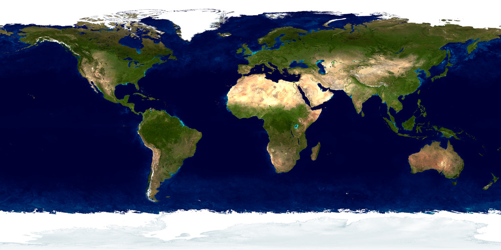

# Ray Tracing The Next Week

https://raytracing.github.io/books/RayTracingTheNextWeek.html


## 1. 概述

在Ray Tracing in One Weekend中，暴力实现了一个光线路径追踪器。

之后，会在其中加入纹理，体积体（例如烟雾），矩形，实例，光源，同时用BVH在进行加速。

当做完这些之后，将拥有一个**真正的**光线追踪器。

本文中最难的两部分是**BVH**和**柏林噪声贴图**。

## 2. 运动模糊

做光线追踪时，如果想要更好的图片质量，则意味着需要更多的程序运行时间。

例如在ray tracing in one weekend的反射部分和镜头散焦模糊中，需要对每个像素进行多重采样。

**几乎所有的特效都可以通过这种暴力来进行实现**。

**运动模糊**也可以通过这种方式来实现，想象一个真实世界的摄像机，在快门打开的时间间隔中，摄像机和物体都可以移动，则拍出来的结果是**整个运动过程中每一帧的平均值**。

### 2.1 光线追踪的空间时间

可以用随机的方法在**不同时间发射多条射线**来模拟快门的打开，只要物体在那个时间处于其正确的位置，则就能得出这条光线在那个时间点的精确平均值。

**一个简单的思路**：在快门打开时，随着时间变化随机生成光线，同时发出射线与模型相交。

一般如果摄像机和物体同时运动，并让每一条射线都拥有自己存在的一个时间点，这样光线追踪就能确定，对于指定的某条光线来说，在该时刻，物体到底在哪儿。

为了实现上述思路，首先要让每条光线都能存储自己所在的时刻，即：

`ray.h`

```c++
class ray {
    public:
        ray() {}
        ray(const point3& origin, const vec3& direction, double time = 0.0)
            : orig(origin), dir(direction), tm(time)
        {}

        point3 origin() const  { return orig; }
        vec3 direction() const { return dir; }
        double time() const    { return tm; }

        point3 at(double t) const {
            return orig + t*dir;
        }

    public:
        point3 orig;
        vec3 dir;
        double tm;
};
```

### 2.2 更新摄像机模拟运动模糊

修改摄像机让其在`time0`至`time1`时间段内随机生成射线，光线的生成时刻是**让camera类自己来运算追踪**还是**让用户自行指定光线在哪个时刻生成**，当出现这种疑惑时，最好的办法是两者同时进行构造。

`camera.h`

```c++
class camera {
    public:
        camera(
            point3 lookfrom,
            point3 lookat,
            vec3   vup,
            double vfov, // vertical field-of-view in degrees
            double aspect_ratio,
            double aperture,
            double focus_dist,
            double _time0 = 0,
            double _time1 = 0
        ) {
            auto theta = degrees_to_radians(vfov);
            auto h = tan(theta/2);
            auto viewport_height = 2.0 * h;
            auto viewport_width = aspect_ratio * viewport_height;

            w = unit_vector(lookfrom - lookat);
            u = unit_vector(cross(vup, w));
            v = cross(w, u);

            origin = lookfrom;
            horizontal = focus_dist * viewport_width * u;
            vertical = focus_dist * viewport_height * v;
            lower_left_corner = origin - horizontal/2 - vertical/2 - focus_dist*w;

            lens_radius = aperture / 2;
            time0 = _time0;
            time1 = _time1;
        }

        ray get_ray(double s, double t) const {
            vec3 rd = lens_radius * random_in_unit_disk();
            vec3 offset = u * rd.x() + v * rd.y();

            return ray(
                origin + offset,
                lower_left_corner + s*horizontal + t*vertical - origin - offset,
                random_double(time0, time1)
            );
        }

    private:
        point3 origin;
        point3 lower_left_corner;
        vec3 horizontal;
        vec3 vertical;
        vec3 u, v, w;
        double lens_radius;
        double time0, time1;  // shutter open/close times
};
```

### 2.3 增加运动的球体

我们还需要一个运动的球体，建立一个新的sphere类，当它的球心在`time0`到`time1`的时间段内从`center0`线性运动到`center1`。超出这个时间段，这个球心依然在动（即做线性插值的时候，t可以大于1.0，也可以小于0），所以这里的两个时间变量和摄像机快门的开关时刻不需要一一对应。

`moving_sphere.h`

```c++
#ifndef THENEXTWEEK_MOVING_SPHERE_H
#define THENEXTWEEK_MOVING_SPHERE_H

#include "rtweekend.h"
#include "hittable.h"

class moving_sphere:public hittable {
public:
    moving_sphere(){}
    moving_sphere(point3 cen0, point3 cen1, double _time0, double _time1, double r, shared_ptr<material> m)
        :center0(cen0), center1(cen1), time0(_time0), time1(_time1), radius(r), mat_ptr(m){};

    virtual bool hit(const ray& r, double t_min, double t_max, hit_record& rec) const override;

    point3 center(double time) const;

public:
    point3 center0, center1;
    double time0, time1;
    double radius;
    shared_ptr<material> mat_ptr;
};

point3 moving_sphere::center(double time) const {
    return center0 + ((time - time0) / (time1 - time0)) * (center1 - center0);
}

#endif //THENEXTWEEK_MOVING_SPHERE_H
```

另外一种让球随着时间动起来的方式是取代之前新建的`moving_sphere`类，只留一个球体，让所有球都动起来，静止的球起点与终点位置相同。

`moving_sphere.h`

```c++
bool moving_sphere::hit(const ray& r, double t_min, double t_max, hit_record& rec) const {
    vec3 oc = r.origin() - center(r.time());
    auto a = r.direction().length_squared();
    auto half_b = dot(oc, r.direction());
    auto c = oc.length_squared() - radius*radius;

    auto discriminant = half_b*half_b - a*c;
    if (discriminant < 0) return false;
    auto sqrtd = sqrt(discriminant);

    // Find the nearest root that lies in the acceptable range.
    auto root = (-half_b - sqrtd) / a;
    if (root < t_min || t_max < root) {
        root = (-half_b + sqrtd) / a;
        if (root < t_min || t_max < root)
            return false;
    }

    rec.t = root;
    rec.p = r.at(rec.t);
    auto outward_normal = (rec.p - center(r.time())) / radius;
    rec.set_face_normal(r, outward_normal);
    rec.mat_ptr = mat_ptr;

    return true;
}
```

### 2.4 跟踪光线相交时间

现在光线有了时间属性，需要更新`material::scatter()`方法来计算相交时间。

`material.h`

```c++
class lambertian : public material {
    ...
        virtual bool scatter(
            const ray& r_in, const hit_record& rec, color& attenuation, ray& scattered
        ) const override {
            auto scatter_direction = rec.normal + random_unit_vector();

            // Catch degenerate scatter direction
            if (scatter_direction.near_zero())
                scatter_direction = rec.normal;

            scattered = ray(rec.p, scatter_direction, r_in.time());
            attenuation = albedo;
            return true;
        }
        ...
};

class metal : public material {
    ...
        virtual bool scatter(
            const ray& r_in, const hit_record& rec, color& attenuation, ray& scattered
        ) const override {
            vec3 reflected = reflect(unit_vector(r_in.direction()), rec.normal);
            scattered = ray(rec.p, reflected + fuzz*random_in_unit_sphere(), r_in.time());
            attenuation = albedo;
            return (dot(scattered.direction(), rec.normal) > 0);
        }
        ...
};

class dielectric : public material {
    ...
        virtual bool scatter(
            ...
            scattered = ray(rec.p, direction, r_in.time());
            return true;
        }
        ...
};
```

### 2.5 把所有其他的东西都加上

下面的代码是在ray tracing in one weekend的最终场景中加以改动，使其中漫反射材质的球动起来。

摄像机的快门在`time0`时打开，在`time1`时关闭。

每个球的中心在`time0`到`time1`的时间段内从原始位置$C$线性运动到$C+(0, r/2, 0)$，其中$r$是$[0,1)$之间的随机数。

`RayTracing.cpp`

```c++
...
#include "moving_sphere.h"

...
hittable_list random_scene() {
    hittable_list world;

    auto ground_material = make_shared<lambertian>(color(0.5, 0.5, 0.5));
    world.add(make_shared<sphere>(point3(0,-1000,0), 1000, ground_material));

    for (int a = -11; a < 11; a++) {
        for (int b = -11; b < 11; b++) {
            auto choose_mat = random_double();
            point3 center(a + 0.9*random_double(), 0.2, b + 0.9*random_double());

            if ((center - vec3(4, 0.2, 0)).length() > 0.9) {
                shared_ptr<material> sphere_material;

                if (choose_mat < 0.8) {
                    // diffuse
                    auto albedo = color::random() * color::random();
                    sphere_material = make_shared<lambertian>(albedo);
                    auto center2 = center + vec3(0, random_double(0,.5), 0);
                    world.add(make_shared<moving_sphere>(
                        center, center2, 0.0, 1.0, 0.2, sphere_material));
                } else if (choose_mat < 0.95) {
                    // metal
                    auto albedo = color::random(0.5, 1);
                    auto fuzz = random_double(0, 0.5);
                    sphere_material = make_shared<metal>(albedo, fuzz);
                    world.add(make_shared<sphere>(center, 0.2, sphere_material));
                } else {
                    // glass
                    sphere_material = make_shared<dielectric>(1.5);
                    world.add(make_shared<sphere>(center, 0.2, sphere_material));
                }
            }
        }
    }

    auto material1 = make_shared<dielectric>(1.5);
    world.add(make_shared<sphere>(point3(0, 1, 0), 1.0, material1));

    auto material2 = make_shared<lambertian>(color(0.4, 0.2, 0.1));
    world.add(make_shared<sphere>(point3(-4, 1, 0), 1.0, material2));

    auto material3 = make_shared<metal>(color(0.7, 0.6, 0.5), 0.0);
    world.add(make_shared<sphere>(point3(4, 1, 0), 1.0, material3));

    return world;
}
```

同时修改视点参数：

`RayTracing.cpp`

```c++
int main() {

    // Image

    auto aspect_ratio = 16.0 / 9.0;
    int image_width = 400;
    int samples_per_pixel = 100;
    const int max_depth = 50;

    ...

    // Camera

    point3 lookfrom(13,2,3);
    point3 lookat(0,0,0);
    vec3 vup(0,1,0);
    auto dist_to_focus = 10.0;
    auto aperture = 0.1;
    int image_height = static_cast<int>(image_width / aspect_ratio);


    camera cam(lookfrom, lookat, vup, 20, aspect_ratio, aperture, dist_to_focus, 0.0, 1.0);
```

得到结果：


## 3. Bounding Volume Hierarchies

BVH（层次包围盒）。

把这部分放在前面，主要是因为**BVH改写了hittable的部分代码**，代码运行更快。

之后添加三角形和箱子类的时候，也不必回来改写hittable。

**光线求交运算一直是光线追踪器的主要时间瓶颈**，运行的时间与场景中的物体数量线性相关。

在遍历物体时，多次查找同一个模型会有多余计算，应该**用二叉搜索的方法来加速查找**。

对每个模型射出多条射线，可以对模型的排序进行模拟，每一次光线求交都是一个**亚线性（subliner）**的查找。

>**亚线性（subliner）**
>
>亚线性指参数的指数小于1，即不到线性，平衡查找树的时间复杂度为$O(log_2(2))$

常见两种排序方法：

- 按空间分割（KD树，八叉树）
- 按物体分割（BVH）

### 3.1 关键思想

BVH的核心思想：找一个能包围所有物体的盒子，假设计算一个包围10个物体的大球，对于任何射不到这个大球的射线，它都无法射到球里的10个物体，反之亦然，如果射线射到了大球，则其与里面的10个物体都有可能相交。

包围盒的代码通常是这个样子的：

```c++
if(ray hits bounding object) {
	return whether ray hits bounded objects;
} else {
	return false;
}
```

关键是如何将物体分成一些子类，注意我们并不划分屏幕或者空间，每个物体都只在一个包围盒里，并且这些包围盒可以重叠。

### 3.2 包围盒的层级

为了使得每次光线求交操作**满足亚线性查找**，需要用包围盒构造出**层级（hierarchical）**。

例如**把物体分为红色和蓝色**，如下图所示：


主要蓝色和红色包围盒在紫色包围盒内部，但是他们没有重叠，也是无序的。

可以写成如下代码：

```c++
if(hits purple) {
	hit0 = hit blue enclosed objects;
	hit1 = hit red enclosed objects;
	if(hit0 or hit1) return true and info of closer hit

	return false;
}
```

### 3.3 AABB包围盒

为了使上面的代码跑起来，需要规划如何建树，同时**如何检测光线与包围盒求交**（求交计算一定要高效，并且包围盒要尽量密集）。

对大多数包围盒来说，**轴对齐包围盒**比其他种类包围盒效果更好。

通常把轴对齐包围盒称为**矩形平行管道（或AABB包围盒）**，第一步要先判断光线能否射中这个包围盒。

与击中那些会在屏幕上显示出来的物体不同，射线与AABB包围盒求交并不需要去获取那些**法向量交点（AABB包围盒不需要在屏幕上渲染出来）**。

多数人常用**堆叠法（slab）**显示n维AABB包围盒，即由n条平行线所截的区间重叠拼出来的区域。


通常称包围的区域为slab，**一个区间就是两个端点间的距离**（例如对于$3<x<5$）。

检测一条射线是否射入一段区间，首先要检测射线是否射入这个区间的边界，对二维来说，检测$t_0$与$t_1$。

（**当光线与目标平面平行的情况下**，因为并没有交点，这两个变量将未定义）


3D中，这些边界是平面，平面方程是$x=x_0$与$x=x_1$。

光线与平面交点可以通过如下计算：

- 光线函数：$P(t)=A+tb$
- 光线与平面交点满足：$x_0=A_x+t_0b_x$
- 可以解出：$t_0=\frac{x_0-A_x}{b_x}$
- 可以得到相似的表达：$t_1=\frac{x_1-A_x}{b_x}$

2D情况下，绿色和蓝色重叠说明穿过了包围盒，情况如下：

- 上面的射线，蓝色与绿色没有重叠，说明光线没有穿过AABB包围盒。
- 下面的射线，蓝色与绿色发生重叠，说明射线同时穿过了蓝色和绿色区域，即穿过了AABB包围盒。

对于一个维度来说，解出$t_0$和$t_1$，表示直线上的两个位置，可以按照维度进行拆分计算，然后通过$t$进行求交运算。


### 3.4 光线与AABB盒交互

下面伪代码表明$t$间隔包围区域slab是否重叠：

```c++
compute(tx0, tx1);
compute(ty0, ty1);
return overlap?((tx0, tx1), (ty0, ty1));
```

对于3维的情况：

```c++
compute(tx0, tx1);
compute(ty0, ty1);
compute(tz0, tz1);
return overlap?((tx0, tx1), (ty0, ty1), (tz0, tz1));
```

需要对上述代码进行一些限制：

- 首先，假设射线从$x$轴负方向射入，这样`compute`区间$(tx_0, tx_1)$的值需要反过来，例如计算结果为$(7,3)$。

- 其次，除数不能为$0$，如果射线就在slab边界上，就会得到NaN值。

不同光线追踪器解决上述方法不一样，对于我们来说，这并不是一个运算瓶颈。

我们直接用最简洁的方式来做：$t_{x0}=\frac{x_0-A_x}{b_x}$，$t_{x_1}=\frac{x_1-A_x}{b_x}$

这里有个问题，当射线恰好在$B_x=0$时，会出现除数为$0$的错误，一些光线在slab里面，一些不在。

对于IEEE浮点型，$0$会有$\pm$号，好消息是当$b_x=0$时，$t_{x0}$和$t_{x1}$会同时为$+\infty$或$-\infty$如果结果不在$x_0$和$x_1$之间，因此可以用min或max函数来得到正确结果：$t_{x0}=\min\left(\frac{x_0-A_x}{b_x},\frac{x_1-A_x}{b_x}\right)$，$t_{x1}=\max\left(\frac{x_0-A_x}{b_x},\frac{x_1-A_x}{b_x}\right)$

现在只剩下分母$B_x=0$并且$x_0-A_x=0$和$x_1-A_x=0$这两个分子之一为$0$的特殊情况，此时会得到一个NaN值。

接着是overlap函数，假设能保证区间没有被倒过来（即第一个值比第二个值小），这种情况下`return true`，则一个计算$(d,D)$和$(e,E)$的重叠区间$(f,F)$函数可以这样表达：

```c++
bool overlap(d, D, e, E, f, F)
    f = max(d, e)
    F = min(D, E)
    return (f < F)
```

如果这里出现了任何的NaN值，结果都会返回`false`。

如果考虑那些擦边的情况，要保证我们的包围盒有一些内间距，把三个维度都写在一个循环中并传入时间间隔$[t_{min},t_{max}]$

`aabb.h`

```c++
#ifndef THENEXTWEEK_AABB_H
#define THENEXTWEEK_AABB_H

#include "rtweekend.h"
class aabb {
public:
    aabb(){}
    aabb(const point3& a, const point3& b) {minimum = a; maximum = b;}

    point3 min() const {return minimum;}
    point3 max() const {return maximum;}

    bool hit(const ray& r, double t_min, double t_max) const {
        for(int a= 0; a < 3; ++a) {
            auto t0 = fmin((minimum[a] - r.origin()[a]) / r.direction()[a],
                                   (maximum[a] - r.origin()[a]) / r.direction()[a]);

            auto t1 = fmax((minimum[a] - r.origin()[a]) / r.direction()[a],
                                   (maximum[a] - r.origin()[a]) / r.direction()[a]);

            t_min = fmax(t0, t_min);
            t_max = fmin(t1, t_max);
            if(t_max <= t_min) return false;
        }
        return true;
    }
    
    point3 minimum;
    point3 maximum;
};


#endif //THENEXTWEEK_AABB_H
```

### 3.5 一个优化的AABB碰撞算法

Andrew Kensler进行了一些实验，提出了下面版本的aabb碰撞代码。

`aabb.g`

```c++
inline bool aabb::hit(const ray& r, double t_min, double t_max) const {
    for(int a= 0; a < 3; ++a) {
        auto invD = 1.0f / r.direction()[a];
        auto t0 = (min()[a] - r.origin()[a]) * invD;
        auto t1 = (max()[a] - r.origin()[a]) * invD;

        if(invD < 0.0f) std::swap(t0, t1);

        t_min = t0 > t_min? t0: t_min;
        t_max = t1 < t_max? t1: t_max;
        if(t_max <= t_min) return false;
    }
    return true;
}
```

### 3.6 为碰撞体构造包围盒

需要添加一个为所有碰撞体计算包围盒的函数，建立一个层次树。

在这个层次树中，所有的图元（例如球体），都会在树的最底端（叶子节点），这个函数返回值是一个bool类型，因为不是所有图元都有包围盒（例如无限延伸的平面）。

另外，**物体会移动**，所以他还要接收`time0`和`time1`，包围盒会把这个时间区间内运动的物体完整包起来。

`hittable.h`

```c++
#include "aabb.h"
...

class hittable {
    public:
        ...
        virtual bool hit(const ray& r, double t_min, double t_max, hit_record& rec) const = 0;
        virtual bool bounding_box(double time0, double time1, aabb& output_box) const = 0;
        ...
};
```

对于一个球类，`bounding_box`函数是比较容易的：

`sphere.h`

```c++
class sphere : public hittable {
    public:
        ...
        virtual bool hit(
            const ray& r, double t_min, double t_max, hit_record& rec) const override;

        virtual bool bounding_box(double time0, double time1, aabb& output_box) const override;
        ...
};

...
bool sphere::bounding_box(double time0, double time1, aabb& output_box) const {
    output_box = aabb(
        center - vec3(radius, radius, radius),
        center + vec3(radius, radius, radius));
    return true;
}
```

对于`moving_sphere`，可以先求球体在$t_0$时刻的包围盒，之后再求$t_1$时刻的包围盒，之后再计算这两个盒子的包围盒：

`moving_sphere.h`

```c++
...
#include "aabb.h"
...

class moving_sphere : public hittable {
    public:
        ...
        virtual bool hit(
            const ray& r, double t_min, double t_max, hit_record& rec) const override;

        virtual bool bounding_box(
            double _time0, double _time1, aabb& output_box) const override;
        ...
};

...
bool moving_sphere::bounding_box(double _time0, double _time1, aabb& output_box) const {
    aabb box0(
        center(_time0) - vec3(radius, radius, radius),
        center(_time0) + vec3(radius, radius, radius));
    aabb box1(
        center(_time1) - vec3(radius, radius, radius),
        center(_time1) + vec3(radius, radius, radius));
    output_box = surrounding_box(box0, box1);
    return true;
}
```

### 3.7 创建物体列表的包围盒

对于`hittable_list`来说，可以在构造函数中就进行包围盒的运算，或者在程序运行时计算。

本文采用运行时计算，因为**这些包围盒的计算一般只有在BVH构造时才会被调用**。

`hittable_list.h`

```c++
...
#include "aabb.h"
...

class hittable_list : public hittable {
    public:
        ...
        virtual bool hit(
            const ray& r, double t_min, double t_max, hit_record& rec) const override;

        virtual bool bounding_box(
            double time0, double time1, aabb& output_box) const override;
    ...
};

...
bool hittable_list::bounding_box(double time0, double time1, aabb& output_box) const {
    if (objects.empty()) return false;

    aabb temp_box;
    bool first_box = true;

    for (const auto& object : objects) {
        if (!object->bounding_box(time0, time1, temp_box)) return false;
        output_box = first_box ? temp_box : surrounding_box(output_box, temp_box);
        first_box = false;
    }

    return true;
}
```

计算两个`aabb`包围盒的函数`surrounding_box`：

`aabb.h`

```c++
aabb surrounding_box(aabb box0, aabb box1) {
    point3 small(fmin(box0.min().x(), box1.min().x()),
                 fmin(box0.min().y(), box1.min().y()),
                 fmin(box0.min().z(), box1.min().z()));

    point3 big(fmax(box0.max().x(), box1.max().x()),
               fmax(box0.max().y(), box1.max().y()),
               fmax(box0.max().z(), box1.max().z()));

    return aabb(small,big);
}
```

### 3.8 BVH结点类

BVH继承`hittable`，相当于一个容器，包住物体，可以计算是否被光线射中。

这里采用一个类加上一个指针搞定：

`bvh.h`

```c++
#ifndef THENEXTWEEK_BVH_H
#define THENEXTWEEK_BVH_H

#include "rtweekend.h"

#include "hittable.h"
#include "hittable_list.h"

class bvh_node: public hittable {
public:
    bvh_node();

    bvh_node(const hittable_list& list, double time0, double time1)
    :bvh_node(list.objects, 0, list.objects.size(), time0, time1){}

    bvh_node(const std::vector<shared_ptr<hittable>>& src_objects, size_t start, size_t end, double time0, double time1);

    virtual bool hit(const ray& r, double t_min, double t_max, hit_record& rec) const override;

    virtual bool bounding_box(double time0, double time1, aabb& output_box) const override;

public:
    shared_ptr<hittable> left;
    shared_ptr<hittable> right;
    aabb box;
};

bool bvh_node::bounding_box(double time0, double time1, aabb &output_box) const {
    output_box = box;
    return true;
}

#endif //THENEXTWEEK_BVH_H
```

注意孩子指针对于hittables也是通用的，他们可以成为其他的`bvh_nodes`，或者是`sphere`，或者是其他的`hittable`。

`hit`函数相当直接：检查这个节点的box是否被击中，如果被击中，则对这个节点的子节点进行判断。

`bvh.h`

```c++
bool bvh_node::hit(const ray &r, double t_min, double t_max, hit_record &rec) const {
    if(!box.hit(r, t_min, t_max)) return false;

    bool hit_left = left->hit(r, t_min, t_max, rec);
    bool hit_right = right->hit(r, t_min, hit_left? rec.t:t_max, rec);

    return hit_left || hit_right;
}
```

### 3.9 展开BVH结果

任何高效的数据结构（例如BVH），最难的部分是如何去构建它。

对于BVH来说，不断地把`bvh_node`中的物体分割成两个子集的同时，`hit`函数也会跟着执行。

如果分割算法很好，两个孩子的包围盒都比其父节点的包围盒要小，则`hit`函数自然会运行地很好，但这样只是运行地快，并不正确，需要在正确和快之间做取舍，在每次分割时沿着一个轴把物体列表分成两半。

**分割原则：**

- 随机选取一个轴分割。
- 使用库函数`sort()`对图元进行排序。
- 对半分，每个子树分一半物体。

物体分割过程递归执行，**当数组传入只剩下两个元素时，两个子树节点各放一个，并结束递归**。

`bvh.h`

```c++
#include <algorithm>
...

bvh_node::bvh_node(
    const std::vector<shared_ptr<hittable>>& src_objects,
    size_t start, size_t end, double time0, double time1
) {
    auto objects = src_objects; // Create a modifiable array of the source scene objects

    int axis = random_int(0,2);
    auto comparator = (axis == 0) ? box_x_compare
                    : (axis == 1) ? box_y_compare
                                  : box_z_compare;

    size_t object_span = end - start;

    if (object_span == 1) {
        left = right = objects[start];
    } else if (object_span == 2) {
        if (comparator(objects[start], objects[start+1])) {
            left = objects[start];
            right = objects[start+1];
        } else {
            left = objects[start+1];
            right = objects[start];
        }
    } else {
        std::sort(objects.begin() + start, objects.begin() + end, comparator);

        auto mid = start + object_span/2;
        left = make_shared<bvh_node>(objects, start, mid, time0, time1);
        right = make_shared<bvh_node>(objects, mid, end, time0, time1);
    }

    aabb box_left, box_right;

    if (  !left->bounding_box (time0, time1, box_left)
       || !right->bounding_box(time0, time1, box_right)
    )
        std::cerr << "No bounding box in bvh_node constructor.\n";

    box = surrounding_box(box_left, box_right);
}
```

`rtweenkend.h`

```c++
inline int random_int(int min, int max) {
    // Returns a random integer in [min,max].
    return static_cast<int>(random_double(min, max+1));
}
```

### 3.10 Box比较函数

之后需要实现Box比较函数，通过`std::sort()`，先判断哪个轴，然脏对应的为我们的比较器赋值。

`bvh.h`

```c++
inline bool box_compare(const shared_ptr<hittable> a, const shared_ptr<hittable> b, int axis) {
    aabb box_a;
    aabb box_b;

    if (!a->bounding_box(0,0, box_a) || !b->bounding_box(0,0, box_b))
        std::cerr << "No bounding box in bvh_node constructor.\n";

    return box_a.min().e[axis] < box_b.min().e[axis];
}


bool box_x_compare (const shared_ptr<hittable> a, const shared_ptr<hittable> b) {
    return box_compare(a, b, 0);
}

bool box_y_compare (const shared_ptr<hittable> a, const shared_ptr<hittable> b) {
    return box_compare(a, b, 1);
}

bool box_z_compare (const shared_ptr<hittable> a, const shared_ptr<hittable> b) {
    return box_compare(a, b, 2);
}
```

## 4. 纹理贴图

图形学中，纹理贴图通常意味着将颜色赋予物体表面的过程。

这个过程可以是通过代码生成纹理，或者是一张图片，也可以二者结合。

这里通过类继承的方式，来实现上述两个功能。

### 4.1 第一个纹理类：连续性纹理

`texture.h`

```c++
#ifndef THENEXTWEEK_TEXTURE_H
#define THENEXTWEEK_TEXTURE_H

#include "rtweekend.h"

class texture {
public:
    virtual color value(double u, double v, const point3& p) const = 0;
};

class solid_color: public texture {
public:
    solid_color(){}
    solid_color(color c):color_value(c) {}

    solid_color(double red, double green, double blue) :solid_color(color(red, green, blue)){}

    virtual color value(double u, double v, const point3& p) const {
        return color_value;
    }

private:
    color color_value;
};

#endif //THENEXTWEEK_TEXTURE_H
```

之后需要更新`hit_record`结构来存储光线与物体交点的`u,v`坐标：

`hittable.h`

```c++
struct hit_record {
    vec3 p;
    vec3 normal;
    shared_ptr<material> mat_ptr;
    double t;
    double u;
    double v;
    bool front_face;
    ...
```

之后也需要为`hittables`计算$(u,v)$纹理坐标。

### 4.2 球体纹理坐标

对于一个球体，纹理坐标通常基于一些经纬度。

例如，对于球面坐标，计算$(\theta,\phi)$，其中$\theta$是从下轴（即$-Y$）向上的角度，$\phi$是绕$Y$轴旋转的角度（从$-X$到$+Z$到$+X$到$-Z$再回到$-X$）。

将$(\theta,\phi)$映射到纹理坐标$(u,v)$，其中$(u=0,v=0)$为纹理的左下角，$u=\frac{\theta}{2\pi},v=\frac{\phi}{\pi}$

为了计算以原点为中心的单位球面上给定点$\theta$和$\phi$，从相应的笛卡尔坐标系开始：

$x=-\cos(\phi)\sin(\theta),y=-\cos(\theta),z=\sin(\phi)\sin(\theta)$

可以通过转换这些方程来计算$\theta$和$\phi$，使用`<cmath>`库中的`atan2()`，取任一对`sin`和`cos`来返回其角度，这里可以用$x$和$z$来求解$\phi$：$\phi=atan2(z,-x)$

`atan2()`返回一个范围值$[-\pi,\pi]$，他们从$[0,\pi]$，之后翻转到$[-\pi,0]$。

虽然这在数学上是正确的，但是这里希望$u$的范围是$[0,1]$，而不是先$[0,\frac{1}{2}]$，再$[-\frac{1}{2},0]$。

幸运的是，有个公式：$atan2(a,b)=atan2(-a,-b)+\pi$，它的值域是$[0,2\pi]$，因此计算$\phi$可以写成：$\phi=atan2(-z,x)+\pi$

对于$\theta$，可以直接求出：$\theta=acos(-y)$

对于一个球体，$(u,v)$坐标计算可以通过一个工具函数来计算：

`sphere.h`

```c++
class sphere : public hittable {
    ...
    private:
        static void get_sphere_uv(const point3& p, double& u, double& v) {
            // p: a given point on the sphere of radius one, centered at the origin.
            // u: returned value [0,1] of angle around the Y axis from X=-1.
            // v: returned value [0,1] of angle from Y=-1 to Y=+1.
            //     <1 0 0> yields <0.50 0.50>       <-1  0  0> yields <0.00 0.50>
            //     <0 1 0> yields <0.50 1.00>       < 0 -1  0> yields <0.50 0.00>
            //     <0 0 1> yields <0.25 0.50>       < 0  0 -1> yields <0.75 0.50>

            auto theta = acos(-p.y());
            auto phi = atan2(-p.z(), p.x()) + pi;

            u = phi / (2*pi);
            v = theta / pi;
        }
};
```

更新`sphere::hit()`函数来使用这个函数，并更新`hit_record`uv坐标：

`sphere.h`

```c++
bool sphere::hit(...) {
    ...

    rec.t = root;
    rec.p = r.at(rec.t);
    vec3 outward_normal = (rec.p - center) / radius;
    rec.set_face_normal(r, outward_normal);
    get_sphere_uv(outward_normal, rec.u, rec.v);
    rec.mat_ptr = mat_ptr;

    return true;
}
```

现在可以通过纹理指针取代`const color& a`来制作一个纹理材质：

`material.h`

```c++
#include "texture.h"

...
class lambertian : public material {
    public:
        lambertian(const color& a) : albedo(make_shared<solid_color>(a)) {}
        lambertian(shared_ptr<texture> a) : albedo(a) {}

        virtual bool scatter(
            const ray& r_in, const hit_record& rec, color& attenuation, ray& scattered
        ) const override {
            auto scatter_direction = rec.normal + random_unit_vector();

            // Catch degenerate scatter direction
            if (scatter_direction.near_zero())
                scatter_direction = rec.normal;

            scattered = ray(rec.p, scatter_direction, r_in.time());
            attenuation = albedo->value(rec.u, rec.v, rec.p);
            return true;
        }

    public:
        shared_ptr<texture> albedo;
};
```

### 4.3 棋盘格纹理

可以使用`sin`和`cos`函数的周期性来做一个棋盘格纹理。

如果在三个维度上都乘以这个周期函数，就会形成一个3维的棋盘格模型。

`texture.h`

```c++
class checker_texture : public texture {
    public:
        checker_texture() {}

        checker_texture(shared_ptr<texture> _even, shared_ptr<texture> _odd)
            : even(_even), odd(_odd) {}

        checker_texture(color c1, color c2)
            : even(make_shared<solid_color>(c1)) , odd(make_shared<solid_color>(c2)) {}

        virtual color value(double u, double v, const point3& p) const override {
            auto sines = sin(10*p.x())*sin(10*p.y())*sin(10*p.z());
            if (sines < 0)
                return odd->value(u, v, p);
            else
                return even->value(u, v, p);
        }

    public:
        shared_ptr<texture> odd;
        shared_ptr<texture> even;
};
```

这些奇偶指针可以指向一个静态纹理，也可以指向一些程序生成的纹理。

> 这是PatHanrahan在1980年代提出的着色器网络的核心思想。

如果把这个纹理贴在`random_scene()`函数里：

`RayTracing.cpp`

```c++
hittable_list random_scene() {
    hittable_list world;

    auto checker = make_shared<checker_texture>(color(0.2, 0.3, 0.1), color(0.9, 0.9, 0.9));
    world.add(make_shared<sphere>(point3(0,-1000,0), 1000, make_shared<lambertian>(checker)));

    for (int a = -11; a < 11; a++) {
        ...
```

得到结果：


### 4.4 使用棋盘格纹理渲染一个场景

我们将要在程序中加入第二个场景，在之后的过程中会加入更多的场景。

为了实现这一点，我们将设置一个硬编码的`switch`语句来为给定的运行选择所需的场景。

`RayTracing.cpp`

```c++
hittable_list two_spheres() {
    hittable_list objects;

    auto checker = make_shared<checker_texture>(color(0.2, 0.3, 0.1), color(0.9, 0.9, 0.9));

    objects.add(make_shared<sphere>(point3(0,-10, 0), 10, make_shared<lambertian>(checker)));
    objects.add(make_shared<sphere>(point3(0, 10, 0), 10, make_shared<lambertian>(checker)));

    return objects;
}
```

`RayTracing.cpp`

```c++
// World

hittable_list world;

point3 lookfrom;
point3 lookat;
auto vfov = 40.0;
auto aperture = 0.0;

switch (0) {
    case 1:
        world = random_scene();
        lookfrom = point3(13,2,3);
        lookat = point3(0,0,0);
        vfov = 20.0;
        aperture = 0.1;
        break;

    default:
    case 2:
        world = two_spheres();
        lookfrom = point3(13,2,3);
        lookat = point3(0,0,0);
        vfov = 20.0;
        break;
}

// Camera

vec3 vup(0,1,0);
auto dist_to_focus = 10.0;
int image_height = static_cast<int>(image_width / aspect_ratio);

camera cam(lookfrom, lookat, vup, vfov, aspect_ratio, aperture, dist_to_focus, 0.0, 1.0);
...
```

得到结果：


## 5 柏林噪声

为了得到一个看上去很cool的纹理，可以使用**柏林噪声（Perlin noise）**。


对噪声做一些模糊处理：


柏林噪声最关键的特点是可复现性，**如果输入的是同一个三维空间中的点，它的输出值总是相同的**。

另一个特点是它实现起来**简单快捷**，因此通常拿柏林噪声来做一些hack的事情。

### 5.1 使用随机数字块

可以用一个随机生成的三维数组铺满整个空间，可以得到明显重复的区块：


不适用**瓷砖贴图**的方式，而是用hash表去完成它：

`perlin.h`

```c++
#ifndef THENEXTWEEK_PERLIN_H
#define THENEXTWEEK_PERLIN_H

#include "rtweekend.h"

class perlin{
public:
    perlin() {
        ranfloat = new double[point_count];
        for(int i = 0; i < point_count; ++i) ranfloat[i] = random_double();

        perm_x = perlin_generate_perm();
        perm_y = perlin_generate_perm();
        perm_z = perlin_generate_perm();
    }

    ~perlin() {
        delete[] ranfloat;
        delete[] perm_x;
        delete[] perm_y;
        delete[] perm_z;
    }

    double noise(const point3& p) const {
        auto i = static_cast<int>(4 * p.x()) & 255;
        auto j = static_cast<int>(4 * p.y()) & 255;
        auto k = static_cast<int>(4 * p.z()) & 255;

        return ranfloat[perm_x[i] ^ perm_y[j] ^ perm_z[k]];
    }

private:
    static const int point_count = 256;
    double* ranfloat;
    int* perm_x;
    int* perm_y;
    int* perm_z;

    static int* perlin_generate_perm() {
        auto p = new int[point_count];
        for(int i = 0; i < perlin::point_count; ++i) p[i] = i;

        permute(p, point_count);

        return p;
    }

    static void permute(int* p, int n) {
        for(int i = n - 1; i > 0; --i) {
            int target = random_int(0, i);
            std::swap(p[i], p[target]);
        }
    }
};

#endif //THENEXTWEEK_PERLIN_H
```

现在来生成一个纹理，使用范围为$[0,1]$的一个float变量来制造灰度图：

`texture.h`

```c++
#include "perlin.h"

class noise_texture : public texture {
    public:
        noise_texture() {}

        virtual color value(double u, double v, const point3& p) const override {
            return color(1,1,1) * noise.noise(p);
        }

    public:
        perlin noise;
};
```

可以在某些球上使用**柏林噪声纹理**：

`RayTracing.h`

```c++
hittable_list two_perlin_spheres() {
    hittable_list objects;

    auto pertext = make_shared<noise_texture>();
    objects.add(make_shared<sphere>(point3(0,-1000,0), 1000, make_shared<lambertian>(pertext)));
    objects.add(make_shared<sphere>(point3(0, 2, 0), 2, make_shared<lambertian>(pertext)));

    return objects;
}
```

`RayTracing.h`

```c++
int main() {
    ...
    switch (0) {
        ...
        case 2:
            ...
        default:
        case 3:
            world = two_perlin_spheres();
            lookfrom = point3(13,2,3);
            lookat = point3(0,0,0);
            vfov = 20.0;
            break;
    }
    ...
```

得到结果：


### 5.2 平滑结果

对其进行线性插值，进行平滑过渡：

`perlin.h`

```c++
class perlin {
    public:
        ...
        double noise(point3 vec3& p) const {
            auto u = p.x() - floor(p.x());
            auto v = p.y() - floor(p.y());
            auto w = p.z() - floor(p.z());

            auto i = static_cast<int>(floor(p.x()));
            auto j = static_cast<int>(floor(p.y()));
            auto k = static_cast<int>(floor(p.z()));
            double c[2][2][2];

            for (int di=0; di < 2; di++)
                for (int dj=0; dj < 2; dj++)
                    for (int dk=0; dk < 2; dk++)
                        c[di][dj][dk] = ranfloat[
                            perm_x[(i+di) & 255] ^
                            perm_y[(j+dj) & 255] ^
                            perm_z[(k+dk) & 255]
                        ];

            return trilinear_interp(c, u, v, w);
        }
        ...
    private:
        ...
        static double trilinear_interp(double c[2][2][2], double u, double v, double w) {
            auto accum = 0.0;
            for (int i=0; i < 2; i++)
                for (int j=0; j < 2; j++)
                    for (int k=0; k < 2; k++)
                        accum += (i*u + (1-i)*(1-u))*
                                (j*v + (1-j)*(1-v))*
                                (k*w + (1-k)*(1-w))*c[i][j][k];

            return accum;
        }
    }
```

得到结果：


### 5.3 使用Hermitian光滑来提升效果

上图中的一部分有**马赫带（Mach bands）**，由于线性变化的颜色构成的有名的视觉感知效果。

这里使用**hermite cube来进行平滑插值**：

`perlin.h`

```c++
class perlin (
    public:
        ...
        double noise(const point3& p) const {
            auto u = p.x() - floor(p.x());
            auto v = p.y() - floor(p.y());
            auto w = p.z() - floor(p.z());
            u = u*u*(3-2*u);
            v = v*v*(3-2*v);
            w = w*w*(3-2*w);

            auto i = static_cast<int>(floor(p.x()));
            auto j = static_cast<int>(floor(p.y()));
            auto k = static_cast<int>(floor(p.z()));
            ...
```

得到结果：


### 5.4 调整频率

上面的图片看上去有一些低频，没有花纹，可以调整输入的点来是它有一个更快的频率：

`texture.h`

```c++
class noise_texture : public texture {
    public:
        noise_texture() {}
        noise_texture(double sc) : scale(sc) {}

        virtual color value(double u, double v, const point3& p) const override {
            return color(1,1,1) * noise.noise(scale * p);
        }

    public:
        perlin noise;
        double scale;
};
```

之后在`two_perlin_spheres()`场景中改变`scale`：

`RayTracing.cpp`

```c++
hittable_list two_perlin_spheres() {
    hittable_list objects;
    auto pertext = make_shared<noise_texture>(4);
    objects.add(make_shared<sphere>(point3(0,-1000,0), 1000, make_shared<lambertian>(pertext)));
    objects.add(make_shared<sphere>(point3(0, 2, 0), 2, make_shared<lambertian>(pertext)));

    return objects;
}
```

得到结果：


### 5.5 在网格点上使用随机向量

现在看上去有一点格子的感觉，也许是因为这方法的最大值和最小值总是精确地落在整数$x/y/z$上。

Ken Perlin有一个十分聪明的而trick，在网格点使用随机的单位向量替代float（即梯度向量），用点乘将min和max值推离网格点。

这里首先把`random float`改成`random vectors`，这些梯度向量可以是任意合理的不规则方向的集合，所以干脆使用单位向量作为梯度向量：

`perlin.h`

```c++
#ifndef THENEXTWEEK_PERLIN_H
#define THENEXTWEEK_PERLIN_H

#include "rtweekend.h"

class perlin{
public:
    perlin() {
        ranvec = new vec3[point_count];
        for(int i = 0; i < point_count; ++i) ranvec[i] = unit_vector(vec3::random(-1, 1));

        perm_x = perlin_generate_perm();
        perm_y = perlin_generate_perm();
        perm_z = perlin_generate_perm();
    }

    ~perlin() {
        delete[] ranvec;
        delete[] perm_x;
        delete[] perm_y;
        delete[] perm_z;
    }

    double noise(const vec3& p) const {
        auto u = p.x() - floor(p.x());
        auto v = p.y() - floor(p.y());
        auto w = p.z() - floor(p.z());

        auto i = static_cast<int>(floor((p.x())));
        auto j = static_cast<int>(floor((p.y())));
        auto k = static_cast<int>(floor((p.z())));

        vec3 c[2][2][2];

        for(int di = 0; di < 2; ++di){
            for(int dj = 0; dj < 2; ++dj){
                for(int dk = 0; dk < 2; ++dk){
                    c[di][dj][dk] = ranvec[
                                perm_x[(i + di) & 255] ^
                                perm_y[(j + dj) & 255] ^
                                perm_z[(k + dk) & 255]
                            ];
                }
            }
        }

        return triliner_interp(c, u, v, w);
    }

private:
    static const int point_count = 256;
    vec3* ranvec;
    int* perm_x;
    int* perm_y;
    int* perm_z;

    static int* perlin_generate_perm() {
        auto p = new int[point_count];
        for(int i = 0; i < perlin::point_count; ++i) p[i] = i;

        permute(p, point_count);

        return p;
    }

    static void permute(int* p, int n) {
        for(int i = n - 1; i > 0; --i) {
            int target = random_int(0, i);
            std::swap(p[i], p[target]);
        }
    }

    static double triliner_interp(vec3 c[2][2][2], double u, double v, double w) {
        auto uu = u * u * (3 - 2 * u);
        auto vv = v * v * (3 - 2 * v);
        auto ww = w * w * (3 - 2 * w);
        auto accum = 0.0;

        for(int i = 0; i < 2; ++i){
            for(int j = 0; j < 2; ++j){
                for(int k = 0; k < 2; ++k){
                    vec3 weight_v(u - i, v - j, w - k);
                    accum += (i * uu + (1 - i) * (1 - uu)) *
                             (j * vv + (1 - j) * (1 - vv)) *
                             (k * ww + (1 - k) * (1 - ww)) *
                             dot(c[i][j][k], weight_v);
                }
            }
        }
        return accum;
    }
};

#endif //THENEXTWEEK_PERLIN_H
```

**柏林插值**的输出结果可能是负数，这些负数在gamma校正时经过开平方根`sqrt()`可能会变成NaN。

因此我们需要将结果映射到$[0,1]$：

`texture.h`

```c++
class noise_texture : public texture {
    public:
        noise_texture() {}
        noise_texture(double sc) : scale(sc) {}

        virtual color value(double u, double v, const point3& p) const override {
            return color(1,1,1) * 0.5 * (1.0 + noise.noise(scale * p));
        }

    public:
        perlin noise;
        double scale;
};
```

最后可以得出如下的结果：


### 5.6 介绍扰动

使用多个频率相加得到复合噪声是一种很常见的做法，称之为**扰动（turbulence）**。

`perlin.h`

```c++
class perlin {
    ...
    public:
        ...
        double turb(const point3& p, int depth=7) const {
            auto accum = 0.0;
            auto temp_p = p;
            auto weight = 1.0;

            for (int i = 0; i < depth; i++) {
                accum += weight*noise(temp_p);
                weight *= 0.5;
                temp_p *= 2;
            }

            return fabs(accum);
        }
        ...
```

`texture.h`

```c++
class noise_texture : public texture {
    public:
        noise_texture() {}
        noise_texture(double sc) : scale(sc) {}

        virtual color value(double u, double v, const point3& p) const override {
            return color(1,1,1) * noise.turb(scale * p);
        }

    public:
        perlin noise;
        double scale;
};
```

直接使用`turb`函数来产生纹理，会得到一个看上去像伪装网一样的东西：


### 5.7 调整参数

通常扰动函数是间接使用的，在程序生成纹理这方面的`hello world`是一个类似大理石的纹理。

基本思路：让颜色与`sin`函数的值成比例，并使用扰动函数去调整相位（平移`sin(x)`中的$x$），使得带状条纹起伏波荡。

修正之前直接使用扰动`turb`或者噪声`noise`给颜色赋值的方法，得到一个类似于大理石的纹理：

`texture.h`

```c++
class noise_texture : public texture {
    public:
        noise_texture() {}
        noise_texture(double sc) : scale(sc) {}

        virtual color value(double u, double v, const point3& p) const override {
            return color(1,1,1) * 0.5 * (1 + sin(scale*p.z() + 10*noise.turb(p)));
        }

    public:
        perlin noise;
        double scale;
};
```

得到如下结果：


## 6. 图片纹理映射

可以使用射入点$p$来映射类似大理石那样程序生成的纹理，也可以读取一张图片，并将一个2维$(u,v)$坐标系映射在图片上。

使用$(u,v)$坐标的一个直接想法是将$u$与$v$调整比例后取整，然后将其对应到像素坐标$(i,j)$上。但是这个方法很糟糕，因为每次照片分辨率发生变化时，都需要修改代码。

图形学一般采用纹理坐标系代替图像坐标系，即使用$[0,1]$之间的小数来表示图像中的位置。

例如，对于一张宽度为$N_x$高度为$N_y$的图像中的像素$(i,j)$，其像素坐标系下的坐标为：$u=\frac{i}{N_x-1},v=\frac{j}{N_y-1}$

对于`hattable`来说，需要在`hit_record`中加入$u$和$v$的记录。

### 6.1 存储图片纹理数据

现在需要新建一个texture类来存放图片，这里使用图片工具库[stb_image](https://github.com/nothings/stb)，下载`stb_image.h`后放入`external`文件夹。

它将图片信息读入一个无符号字符类型（unsigned char）的大数组中，将RGB值规定在范围$[0,255]$，从全黑到全白。

`texture.h`

```c++
#include "rtweekend.h"
#include "rtw_stb_image.h"
#include "perlin.h"

#include <iostream>

...

class image_texture : public texture {
    public:
        const static int bytes_per_pixel = 3;

        image_texture()
          : data(nullptr), width(0), height(0), bytes_per_scanline(0) {}

        image_texture(const char* filename) {
            auto components_per_pixel = bytes_per_pixel;

            data = stbi_load(
                filename, &width, &height, &components_per_pixel, components_per_pixel);

            if (!data) {
                std::cerr << "ERROR: Could not load texture image file '" << filename << "'.\n";
                width = height = 0;
            }

            bytes_per_scanline = bytes_per_pixel * width;
        }

        ~image_texture() {
            delete data;
        }

        virtual color value(double u, double v, const vec3& p) const override {
            // If we have no texture data, then return solid cyan as a debugging aid.
            if (data == nullptr)
                return color(0,1,1);

            // Clamp input texture coordinates to [0,1] x [1,0]
            u = clamp(u, 0.0, 1.0);
            v = 1.0 - clamp(v, 0.0, 1.0);  // Flip V to image coordinates

            auto i = static_cast<int>(u * width);
            auto j = static_cast<int>(v * height);

            // Clamp integer mapping, since actual coordinates should be less than 1.0
            if (i >= width)  i = width-1;
            if (j >= height) j = height-1;

            const auto color_scale = 1.0 / 255.0;
            auto pixel = data + j*bytes_per_scanline + i*bytes_per_pixel;

            return color(color_scale*pixel[0], color_scale*pixel[1], color_scale*pixel[2]);
        }

    private:
        unsigned char *data;
        int width, height;
        int bytes_per_scanline;
};
```

`rtw_stb_image.h`

```c++
#ifndef RTWEEKEND_STB_IMAGE_H
#define RTWEEKEND_STB_IMAGE_H

// Disable pedantic warnings for this external library.
#ifdef _MSC_VER
    // Microsoft Visual C++ Compiler
    #pragma warning (push, 0)
#endif

#define STB_IMAGE_IMPLEMENTATION
#include "external/stb_image.h"

// Restore warning levels.
#ifdef _MSC_VER
    // Microsoft Visual C++ Compiler
    #pragma warning (pop)
#endif

#endif
```

### 6.2 使用图片纹理

这里选用一张地球的纹理：



修改代码，读取一张图片并将其指定为漫反射材质。

`RayTracing.cpp`

```c++
hittable_list earth() {
    auto earth_texture = make_shared<image_texture>("earthmap.jpg");
    auto earth_surface = make_shared<lambertian>(earth_texture);
    auto globe = make_shared<sphere>(point3(0,0,0), 2, earth_surface);

    return hittable_list(globe);
}
```

这里可以感受一下texture类的魅力，可以将任意一种类的纹理（贴图）运用到lambertian材质上，同时这里lambertian材质不需要关心其输入的是图片还是其他。

`RayTracing.cpp`

```c++
int main() {
    ...
    switch (0) {
        ...
        default:
        case 3:
            ...
        default:
        case 4:
            world = earth();
            lookfrom = point3(13,2,3);
            lookat = point3(0,0,0);
            vfov = 20.0;
            break;
    }
    ...
```

如果生成的图片是一张青色的球体图，则说明`stb_image`没有加载`earthmap.jpg`，

确保将`earthmap.jpg`的路径设置正确（mac系统可能要设置成完整路径）。


## 7. 矩形和光源

**光源**是光线追踪里的一个关键组件。

早期简单的光线追踪器使用抽象的光源，例如空间中点光源或直接光照。

**现代方法更多的采用基于物理的光源，有位置和大小**。

为了创建这样的光源，我们需要能够将任何常规的物体转换成在场景中发出光的东西。

### 7.1 发光材质

首先，需要制作一个发光材质，需要增加一个发光函数。

`material.h`

```c++
class diffuse_light : public material  {
    public:
        diffuse_light(shared_ptr<texture> a) : emit(a) {}
        diffuse_light(color c) : emit(make_shared<solid_color>(c)) {}

        virtual bool scatter(
            const ray& r_in, const hit_record& rec, color& attenuation, ray& scattered
        ) const override {
            return false;
        }

        virtual color emitted(double u, double v, const point3& p) const override {
            return emit->value(u, v, p);
        }

    public:
        shared_ptr<texture> emit;
};
```

为了不去给每个不是光源的材质实现`emitted()`函数，这里并不使用纯虚函数，让函数默认返回黑色：

`material.h`

```c++
class material {
    public:
        virtual color emitted(double u, double v, const point3& p) const {
            return color(0,0,0);
        }
        virtual bool scatter(
            const ray& r_in, const hit_record& rec, color& attenuation, ray& scattered
        ) const = 0;
};
```

### 7.2 对光线颜色函数增加背景色

接下来需要一个纯黑的背景，并让所有光线都来自光源材质。

要想实现它，需要在`ray_color`函数中加入一个背景色变量，然后由`emitted`函数产生新的颜色值。

`RayTracing.cpp`

```c++
color ray_color(const ray& r, const color& background, const hittable& world, int depth) {
    hit_record rec;

    // If we've exceeded the ray bounce limit, no more light is gathered.
    if (depth <= 0)
        return color(0,0,0);

    // If the ray hits nothing, return the background color.
    if (!world.hit(r, 0.001, infinity, rec))
        return background;

    ray scattered;
    color attenuation;
    color emitted = rec.mat_ptr->emitted(rec.u, rec.v, rec.p);

    if (!rec.mat_ptr->scatter(r, rec, attenuation, scattered))
        return emitted;

    return emitted + attenuation * ray_color(scattered, background, world, depth-1);
}
...

int main() {
    ...

    point3 lookfrom;
    point3 lookat;
    auto vfov = 40.0;
    auto aperture = 0.0;
    color background(0,0,0);

    switch (0) {
        case 1:
            world = random_scene();
            background = color(0.70, 0.80, 1.00);
            lookfrom = point3(13,2,3);
            lookat = point3(0,0,0);
            vfov = 20.0;
            aperture = 0.1;
            break;

        case 2:
            world = two_spheres();
            background = color(0.70, 0.80, 1.00);
            lookfrom = point3(13,2,3);
            lookat = point3(0,0,0);
            vfov = 20.0;
            break;

        case 3:
            world = two_perlin_spheres();
            background = color(0.70, 0.80, 1.00);
            lookfrom = point3(13,2,3);
            lookat = point3(0,0,0);
            vfov = 20.0;
            break;

        default:
        case 4:
            world = earth();
            background = color(0.70, 0.80, 1.00);
            lookfrom = point3(13,2,3);
            lookat = point3(0,0,0);
            vfov = 20.0;
            break;

        default:
        case 5:
            background = color(0.0, 0.0, 0.0);
            break;
    }

    ...
                pixel_color += ray_color(r, background, world, max_depth);
    ...
}
```

由于删除了用于确定光线击中天空时的颜色代码，所以需要**为旧场景传如一个新的颜色值**（这里选择整个天空使用平坦的蓝白色），可以使用一个bool值来切换之前的天空框代码和新的纯色背景。

### 7.3 创建矩形对象

现在，可以加入一些矩形，矩形在人为建模环境时很方便使用（例如轴对齐的矩形）。

首先有一个xy平面的矩形，这个平面根据它的z值来定义（例如$z=k$），一个轴对齐的矩形可以通过如下方式来进行定义（$x=x_0,x=x_1,y=y_0,y=y_1$）。


为了检测是否有光线与这个矩形相交，首先需要判断光线与这个平面的交点。

对于一条射线：$P(t)=A+tb$，当$z$值确定后，可以写为：$P_z(t)=A_z+tb_z$，解出：$t=\frac{k-A_z}{b_z}$

一旦确定了$t$，可以将其带入$x$和$y$的方程：$x=A_x+tb_x,y=A_y+tb_y$

当且仅当：$x_0<x<x_1, y_0<y<y_1$时，发生相交。

由于矩形是**轴对齐的**，它们的边界框将有一个无限薄的边，当使用轴对齐的包围盒来划分它们时，会有精度问题。

为了解决这个问题，需要对所有命中的对象都设置一个边界框，**在每个维度上都有一个有限的宽度**。

因此，对于上面的矩形，**需要在无限薄的边填充一些盒子**。

`aarect.h`

```c++
#ifndef AARECT_H
#define AARECT_H

#include "rtweekend.h"

#include "hittable.h"

class xy_rect : public hittable {
    public:
        xy_rect() {}

        xy_rect(double _x0, double _x1, double _y0, double _y1, double _k, 
            shared_ptr<material> mat)
            : x0(_x0), x1(_x1), y0(_y0), y1(_y1), k(_k), mp(mat) {};

        virtual bool hit(const ray& r, double t_min, double t_max, hit_record& rec) const override;

        virtual bool bounding_box(double time0, double time1, aabb& output_box) const override {
            // The bounding box must have non-zero width in each dimension, so pad the Z
            // dimension a small amount.
            output_box = aabb(point3(x0,y0, k-0.0001), point3(x1, y1, k+0.0001));
            return true;
        }

    public:
        shared_ptr<material> mp;
        double x0, x1, y0, y1, k;
};

#endif
```

相交函数：

`aarect.h`

```c++
bool xy_rect::hit(const ray& r, double t_min, double t_max, hit_record& rec) const {
    auto t = (k-r.origin().z()) / r.direction().z();
    if (t < t_min || t > t_max)
        return false;
    auto x = r.origin().x() + t*r.direction().x();
    auto y = r.origin().y() + t*r.direction().y();
    if (x < x0 || x > x1 || y < y0 || y > y1)
        return false;
    rec.u = (x-x0)/(x1-x0);
    rec.v = (y-y0)/(y1-y0);
    rec.t = t;
    auto outward_normal = vec3(0, 0, 1);
    rec.set_face_normal(r, outward_normal);
    rec.mat_ptr = mp;
    rec.p = r.at(t);
    return true;
}
```

### 7.4 将物体变成光源

设置一个矩形为光源：

`RayTracing.cpp`

```c++
hittable_list simple_light() {
    hittable_list objects;

    auto pertext = make_shared<noise_texture>(4);
    objects.add(make_shared<sphere>(point3(0,-1000,0), 1000, make_shared<lambertian>(pertext)));
    objects.add(make_shared<sphere>(point3(0,2,0), 2, make_shared<lambertian>(pertext)));

    auto difflight = make_shared<diffuse_light>(color(4,4,4));
    objects.add(make_shared<xy_rect>(3, 5, 1, 3, -2, difflight));

    return objects;
}
```

新建一个场景，注意要设置背景为黑色：

`RayTracing.cpp`

```c++
#include "rtweekend.h"

#include "camera.h"
#include "color.h"
#include "hittable_list.h"
#include "material.h"
#include "moving_sphere.h"
#include "sphere.h"
#include "aarect.h"

#include <iostream>
...
int main() {
    ...
    switch (0) {
        ...
        default:
        case 5:
            world = simple_light();
            samples_per_pixel = 400;
            background = color(0,0,0);
            lookfrom = point3(26,3,6);
            lookat = point3(0,2,0);
            vfov = 20.0;
            break;
    }
    ...
```

得到结果：


注意现在的光比$(1,1,1)$要亮，所以这个亮度足够它去照亮其他东西了。

同样的方法，也可做一个圆形的光源：

`RayTracing.cpp`

```c++
hittable_list simple_light() {
    hittable_list objects;

    auto pertext = make_shared<noise_texture>(4);
    objects.add(make_shared<sphere>(point3(0, -1000, 0), 1000, make_shared<lambertian>(pertext)));
    objects.add(make_shared<sphere>(point3(0, 2, 0), 2, make_shared<lambertian>(pertext)));

    auto difflight = make_shared<diffuse_light>(color(4, 4, 4));
    objects.add(make_shared<xy_rect>(3, 5, 1, 3, -2, difflight));
    objects.add(make_shared<sphere>(point3(0, 2, 3), 2, difflight));

    return objects;
}
```


### 7.5 更多轴对齐的矩形

增加另外两个轴，然后形成一个**Cornell盒子**。

`arrect.h`

```c++
class xz_rect : public hittable {
public:
    xz_rect() {}

    xz_rect(double _x0, double _x1, double _z0, double _z1, double _k, shared_ptr<material> mat)
            : x0(_x0), x1(_x1), z0(_z0), z1(_z1), k(_k), mp(mat) {};

    virtual bool hit(const ray& r, double t_min, double t_max, hit_record& rec) const override;

    virtual bool bounding_box(double time0, double time1, aabb& output_box) const override {
        // The bounding box must have non-zero width in each dimension, so pad the Y
        // dimension a small amount.
        output_box = aabb(point3(x0,k-0.0001,z0), point3(x1, k+0.0001, z1));
        return true;
    }

public:
    shared_ptr<material> mp;
    double x0, x1, z0, z1, k;
};

bool xz_rect::hit(const ray& r, double t_min, double t_max, hit_record& rec) const {
    auto t = (k - r.origin().y()) / r.direction().y();
    if (t < t_min || t > t_max) return false;

    auto x = r.origin().x() + t * r.direction().x();
    auto z = r.origin().z() + t * r.direction().z();
    if (x < x0 || x > x1 || z < z0 || z > z1) return false;

    rec.u = (x - x0) / (x1 - x0);
    rec.v = (z - z0) / (z1 - z0);
    rec.t = t;

    auto outward_normal = vec3(0, 1, 0);
    rec.set_face_normal(r, outward_normal);
    rec.mat_ptr = mp;
    rec.p = r.at(t);

    return true;
}


class yz_rect : public hittable {
public:
    yz_rect() {}

    yz_rect(double _y0, double _y1, double _z0, double _z1, double _k, shared_ptr<material> mat)
            : y0(_y0), y1(_y1), z0(_z0), z1(_z1), k(_k), mp(mat) {};

    virtual bool hit(const ray& r, double t_min, double t_max, hit_record& rec) const override;

    virtual bool bounding_box(double time0, double time1, aabb& output_box) const override {
        // The bounding box must have non-zero width in each dimension, so pad the X
        // dimension a small amount.
        output_box = aabb(point3(k-0.0001, y0, z0), point3(k+0.0001, y1, z1));
        return true;
    }

public:
    shared_ptr<material> mp;
    double y0, y1, z0, z1, k;
};

bool yz_rect::hit(const ray& r, double t_min, double t_max, hit_record& rec) const {
    auto t = (k - r.origin().x()) / r.direction().x();
    if (t < t_min || t > t_max) return false;

    auto y = r.origin().y() + t * r.direction().y();
    auto z = r.origin().z() + t * r.direction().z();
    if (y < y0 || y > y1 || z < z0 || z > z1) return false;

    rec.u = (y - y0) / (y1 - y0);
    rec.v = (z - z0) / (z1 - z0);
    rec.t = t;

    auto outward_normal = vec3(1, 0, 0);
    rec.set_face_normal(r, outward_normal);
    rec.mat_ptr = mp;
    rec.p = r.at(t);
    
    return true;
}
```

### 7.6 创建一个空的Cornell盒子

`RayTracing.cpp`

```c++
hittable_list cornell_box() {
    hittable_list objects;

    auto red   = make_shared<lambertian>(color(.65, .05, .05));
    auto white = make_shared<lambertian>(color(.73, .73, .73));
    auto green = make_shared<lambertian>(color(.12, .45, .15));
    auto light = make_shared<diffuse_light>(color(15, 15, 15));

    objects.add(make_shared<yz_rect>(0, 555, 0, 555, 555, green));
    objects.add(make_shared<yz_rect>(0, 555, 0, 555, 0, red));
    objects.add(make_shared<xz_rect>(213, 343, 227, 332, 554, light));
    objects.add(make_shared<xz_rect>(0, 555, 0, 555, 0, white));
    objects.add(make_shared<xz_rect>(0, 555, 0, 555, 555, white));
    objects.add(make_shared<xy_rect>(0, 555, 0, 555, 555, white));

    return objects;
}
```

`RayTracing.cpp`

```c++
int main() {
    ...
    switch (0) {
        ...
        default:
        case 5:
            ...
            break;

        default:
        case 6:
            world = cornell_box();
            aspect_ratio = 1.0;
            image_width = 600;
            samples_per_pixel = 200;
            background = color(0,0,0);
            lookfrom = point3(278, 278, -800);
            lookat = point3(278, 278, 0);
            vfov = 40.0;
            break;
    }
    ...
```

得到结果：


这张图片有很多噪声，因为光源很小。

## 8. 实例

Cornell盒子里通常由两个物体，这些是相对于壁面旋转的。

首先，创建一个包含6个平面组成的轴对齐块元素：

`box.h`

```c++
#ifndef THENEXTWEEK_BOX_H
#define THENEXTWEEK_BOX_H

#include "rtweekend.h"

#include "aarect.h"
#include "hittable_list.h"

class box : public hittable  {
public:
    box() {}
    box(const point3& p0, const point3& p1, shared_ptr<material> ptr);

    virtual bool hit(const ray& r, double t_min, double t_max, hit_record& rec) const override;

    virtual bool bounding_box(double time0, double time1, aabb& output_box) const override {
        output_box = aabb(box_min, box_max);
        return true;
    }

public:
    point3 box_min;
    point3 box_max;
    hittable_list sides;
};

box::box(const point3& p0, const point3& p1, shared_ptr<material> ptr) {
    box_min = p0;
    box_max = p1;

    sides.add(make_shared<xy_rect>(p0.x(), p1.x(), p0.y(), p1.y(), p1.z(), ptr));
    sides.add(make_shared<xy_rect>(p0.x(), p1.x(), p0.y(), p1.y(), p0.z(), ptr));

    sides.add(make_shared<xz_rect>(p0.x(), p1.x(), p0.z(), p1.z(), p1.y(), ptr));
    sides.add(make_shared<xz_rect>(p0.x(), p1.x(), p0.z(), p1.z(), p0.y(), ptr));

    sides.add(make_shared<yz_rect>(p0.y(), p1.y(), p0.z(), p1.z(), p1.x(), ptr));
    sides.add(make_shared<yz_rect>(p0.y(), p1.y(), p0.z(), p1.z(), p0.x(), ptr));
}

bool box::hit(const ray& r, double t_min, double t_max, hit_record& rec) const {
    return sides.hit(r, t_min, t_max, rec);
}

#endif //THENEXTWEEK_BOX_H
```

之后添加两个物体：

`RayTracing.cpp`

```c++
#include "box.h"
...
objects.add(make_shared<box>(point3(130, 0, 65), point3(295, 165, 230), white));
objects.add(make_shared<box>(point3(265, 0, 295), point3(430, 330, 460), white));
```

得到结果：


现在有了两个长方体，为了让它们更接近正宗的Cornell盒子，需要让它们旋转一下。

光线追踪中，通常使用**实例（Instance）**来完成这个工作。

实例是一种经过旋转或者平移等操作的几何图元，这在光线追踪中更加简单，因为我们不需要移动任何东西，取代而之是将光线移动到相反的方向。

例如，对于一个平移操作，我们可以取原点的粉色方框，将它所有的x分量加$2$，或者（就像我们在光线追踪中经常做的那样）让方框保持原样，但是在它的`hit`过程中，将射线原点的方向减去$2$。


### 8.1 实例移动

移动`hittable`类的translate代码如下：

`hittable.h`

```c++
class translate : public hittable {
    public:
        translate(shared_ptr<hittable> p, const vec3& displacement)
            : ptr(p), offset(displacement) {}

        virtual bool hit(
            const ray& r, double t_min, double t_max, hit_record& rec) const override;

        virtual bool bounding_box(double time0, double time1, aabb& output_box) const override;

    public:
        shared_ptr<hittable> ptr;
        vec3 offset;
};

bool translate::hit(const ray& r, double t_min, double t_max, hit_record& rec) const {
    ray moved_r(r.origin() - offset, r.direction(), r.time());
    if (!ptr->hit(moved_r, t_min, t_max, rec))
        return false;

    rec.p += offset;
    rec.set_face_normal(moved_r, rec.normal);

    return true;
}

bool translate::bounding_box(double time0, double time1, aabb& output_box) const {
    if (!ptr->bounding_box(time0, time1, output_box))
        return false;

    output_box = aabb(
        output_box.min() + offset,
        output_box.max() + offset);

    return true;
}
```

### 8.2 实例旋转

旋转可能就没有那么容易理解或者列出方程。

一个常用的图像技巧是**将所有的旋转都当成是绕$xyz$轴旋转**。

首先，绕$z$轴旋转，这样只会改变$xy$而不会改变$z$值。


这里包含了一些三角几何，绕$z$轴逆时针旋转的公式如下：

- $x'=\cos(\theta)\cdot x-\sin(\theta)\cdot{y}$
- $y'=\sin(\theta)\cdot x+\cos(\theta)\cdot{y}$

这个公式对任何$\theta$都成立，不需要考虑象限问题，如果要顺时针旋转，只需把$\theta$改为$-\theta$即可。

类似的，绕$y$轴旋转的公式如下：

- $x'=\cos(\theta)\cdot x+\sin(\theta)\cdot{z}$
- $y'=-\sin(\theta)\cdot x+\cos(\theta)\cdot{z}$

绕$x$轴旋转的公式如下：

- $y'=\cos(\theta)\cdot y-\sin(\theta)\cdot{z}$
- $z'=\sin(\theta)\cdot y+\cos(\theta)\cdot{z}$

与平移变换不同，旋转时表面法向量也发生了变化，所以在计算完`hit`函数后还要重新计算法向量。

`hittable.h`

```c++
class rotate_y : public hittable {
public:
    rotate_y(shared_ptr<hittable> p, double angle);

    virtual bool hit(const ray& r, double t_min, double t_max, hit_record& rec) const override;

    virtual bool bounding_box(double time0, double time1, aabb& output_box) const override {
        output_box = bbox;
        return hasbox;
    }

public:
    shared_ptr<hittable> ptr;
    double sin_theta;
    double cos_theta;
    bool hasbox;
    aabb bbox;
};

rotate_y::rotate_y(shared_ptr<hittable> p, double angle) : ptr(p) {
    auto radians = degrees_to_radians(angle);
    sin_theta = sin(radians);
    cos_theta = cos(radians);
    hasbox = ptr->bounding_box(0, 1, bbox);

    point3 min( infinity,  infinity,  infinity);
    point3 max(-infinity, -infinity, -infinity);

    for (int i = 0; i < 2; i++) {
        for (int j = 0; j < 2; j++) {
            for (int k = 0; k < 2; k++) {
                auto x = i * bbox.max().x() + (1 - i) * bbox.min().x();
                auto y = j * bbox.max().y() + (1 - j) * bbox.min().y();
                auto z = k * bbox.max().z() + (1 - k) * bbox.min().z();

                auto newx =  cos_theta * x + sin_theta * z;
                auto newz = -sin_theta * x + cos_theta * z;

                vec3 tester(newx, y, newz);

                for (int c = 0; c < 3; c++) {
                    min[c] = fmin(min[c], tester[c]);
                    max[c] = fmax(max[c], tester[c]);
                }
            }
        }
    }

    bbox = aabb(min, max);
}

bool rotate_y::hit(const ray& r, double t_min, double t_max, hit_record& rec) const {
    auto origin = r.origin();
    auto direction = r.direction();

    origin[0] = cos_theta * r.origin()[0] - sin_theta * r.origin()[2];
    origin[2] = sin_theta * r.origin()[0] + cos_theta * r.origin()[2];

    direction[0] = cos_theta * r.direction()[0] - sin_theta * r.direction()[2];
    direction[2] = sin_theta * r.direction()[0] + cos_theta * r.direction()[2];

    ray rotated_r(origin, direction, r.time());

    if (!ptr->hit(rotated_r, t_min, t_max, rec)) return false;

    auto p = rec.p;
    auto normal = rec.normal;

    p[0] =  cos_theta * rec.p[0] + sin_theta * rec.p[2];
    p[2] = -sin_theta * rec.p[0] + cos_theta * rec.p[2];

    normal[0] =  cos_theta * rec.normal[0] + sin_theta * rec.normal[2];
    normal[2] = -sin_theta * rec.normal[0] + cos_theta * rec.normal[2];

    rec.p = p;
    rec.set_face_normal(rotated_r, normal);

    return true;
}
```

改变Cornell盒子：

`RayTracing.cpp`

```c++
shared_ptr<hittable> box1 = make_shared<box>(point3(0, 0, 0), point3(165, 330, 165), white);
box1 = make_shared<rotate_y>(box1, 15);
box1 = make_shared<translate>(box1, vec3(265,0,295));
objects.add(box1);

shared_ptr<hittable> box2 = make_shared<box>(point3(0,0,0), point3(165,165,165), white);
box2 = make_shared<rotate_y>(box2, -18);
box2 = make_shared<translate>(box2, vec3(130,0,65));
objects.add(box2);
```

得到结果：


## 9. 体积体

给光线追踪器加入**烟/雾/水汽**是一件很cool的事情，这些东西称为**体积体（Volumes）**或**可参与介质（participating media）**。**次表面散射（sub surface scatter， SSS）**是另一个不错的特性，有点像物体内部的浓雾。

体积体和平面表面是完全不同的两种东西，但是可以通过将体积体表示为一个随机表面（例如，**一团烟雾可以用一个概率上不确定在什么位置的平面来代替**）。

首先生成一个**固定密度的体积体**，光线可以在体积体内部发生散射，也可以像下图那条射线一样直接穿出去。体积体越薄越透明，直接传过去的情况就越有可能发生，光线在体积体中直线传播所经过的距离也决定了光线采用图中哪种方式通过体积体。


当光线射入体积体时，它可能在任意一点发生散射。体积体越浓，越可能发生散射。

在任意微小的距离差$\triangle L$发生散射的概率：$probability = C \cdot \triangle L$，其中$C$是体积体的光学密度比例常数。

经过一系列不同的等式运算，可以随机得到一个光线发生散射的距离值，根据这个距离来说，散射点在体积体外，则我们认为没有相交，不调用`hit`函数。

对于一个静态的体积体来说，只需要它的密度$C$和边界。

用另一个`hittable`物体来表示体积体边界：

`constant_medium.h`

```c++
#ifndef CONSTANT_MEDIUM_H
#define CONSTANT_MEDIUM_H

#include "rtweekend.h"

#include "hittable.h"
#include "material.h"
#include "texture.h"

class constant_medium : public hittable {
    public:
        constant_medium(shared_ptr<hittable> b, double d, shared_ptr<texture> a)
            : boundary(b),
              neg_inv_density(-1/d),
              phase_function(make_shared<isotropic>(a))
            {}

        constant_medium(shared_ptr<hittable> b, double d, color c)
            : boundary(b),
              neg_inv_density(-1/d),
              phase_function(make_shared<isotropic>(c))
            {}

        virtual bool hit(
            const ray& r, double t_min, double t_max, hit_record& rec) const override;

        virtual bool bounding_box(double time0, double time1, aabb& output_box) const override {
            return boundary->bounding_box(time0, time1, output_box);
        }

    public:
        shared_ptr<hittable> boundary;
        shared_ptr<material> phase_function;
        double neg_inv_density;
};

#endif
```

对于散射方向来说，采用**各项同性（isotropic）的随机单位向量**计算：

`material.h`

```c++
class isotropic : public material {
    public:
        isotropic(color c) : albedo(make_shared<solid_color>(c)) {}
        isotropic(shared_ptr<texture> a) : albedo(a) {}

        virtual bool scatter(
            const ray& r_in, const hit_record& rec, color& attenuation, ray& scattered
        ) const override {
            scattered = ray(rec.p, random_in_unit_sphere(), r_in.time());
            attenuation = albedo->value(rec.u, rec.v, rec.p);
            return true;
        }

    public:
        shared_ptr<texture> albedo;
};
```

`hit`函数为：

`constant_medium.h`

```c++
bool constant_medium::hit(const ray& r, double t_min, double t_max, hit_record& rec) const {
    // Print occasional samples when debugging. To enable, set enableDebug true.
    const bool enableDebug = false;
    const bool debugging = enableDebug && random_double() < 0.00001;

    hit_record rec1, rec2;

    if (!boundary->hit(r, -infinity, infinity, rec1))
        return false;

    if (!boundary->hit(r, rec1.t+0.0001, infinity, rec2))
        return false;

    if (debugging) std::cerr << "\nt_min=" << rec1.t << ", t_max=" << rec2.t << '\n';

    if (rec1.t < t_min) rec1.t = t_min;
    if (rec2.t > t_max) rec2.t = t_max;

    if (rec1.t >= rec2.t)
        return false;

    if (rec1.t < 0)
        rec1.t = 0;

    const auto ray_length = r.direction().length();
    const auto distance_inside_boundary = (rec2.t - rec1.t) * ray_length;
    const auto hit_distance = neg_inv_density * log(random_double());

    if (hit_distance > distance_inside_boundary)
        return false;

    rec.t = rec1.t + hit_distance / ray_length;
    rec.p = r.at(rec.t);

    if (debugging) {
        std::cerr << "hit_distance = " <<  hit_distance << '\n'
                  << "rec.t = " <<  rec.t << '\n'
                  << "rec.p = " <<  rec.p << '\n';
    }

    rec.normal = vec3(1,0,0);  // arbitrary
    rec.front_face = true;     // also arbitrary
    rec.mat_ptr = phase_function;

    return true;
}
```

一定要小心与边界相关的逻辑，因为要确保当射线原点在体积体内部时，光线依然会发生散射。

在云中，光线反复发生散射，这是一种很常见的现象。

另外，上面的代码只能确保射线只会射入体积体一次，之后再也不进入体积体的情况（即，它假定体积体的边界是一个凸几何体，所以这个狭义的实现只对球体或长方体这样的物体生效，对于当中有洞的那种形状，例如甜甜圈就不行）。

### 9.2 使用烟和雾来渲染一个Cornell盒子

如果将两个长方体替换为烟和雾（深色与浅色的粒子）并使用一个更大的灯光（同时更加昏暗以至于不会炸了这个场景）让场景更快的融合在一起。

`RayTracing.cpp`

```c++
#include "constant_medium.h"
...

hittable_list cornell_smoke() {
    hittable_list objects;

    auto red   = make_shared<lambertian>(color(.65, .05, .05));
    auto white = make_shared<lambertian>(color(.73, .73, .73));
    auto green = make_shared<lambertian>(color(.12, .45, .15));
    auto light = make_shared<diffuse_light>(color(7, 7, 7));

    objects.add(make_shared<yz_rect>(0, 555, 0, 555, 555, green));
    objects.add(make_shared<yz_rect>(0, 555, 0, 555, 0, red));
    objects.add(make_shared<xz_rect>(113, 443, 127, 432, 554, light));
    objects.add(make_shared<xz_rect>(0, 555, 0, 555, 555, white));
    objects.add(make_shared<xz_rect>(0, 555, 0, 555, 0, white));
    objects.add(make_shared<xy_rect>(0, 555, 0, 555, 555, white));

    shared_ptr<hittable> box1 = make_shared<box>(point3(0,0,0), point3(165,330,165), white);
    box1 = make_shared<rotate_y>(box1, 15);
    box1 = make_shared<translate>(box1, vec3(265,0,295));

    shared_ptr<hittable> box2 = make_shared<box>(point3(0,0,0), point3(165,165,165), white);
    box2 = make_shared<rotate_y>(box2, -18);
    box2 = make_shared<translate>(box2, vec3(130,0,65));

    objects.add(make_shared<constant_medium>(box1, 0.01, color(0,0,0)));
    objects.add(make_shared<constant_medium>(box2, 0.01, color(1,1,1)));

    return objects;
}

...

int main() {
    ...
    switch (0) {
        ...
        default:
        case 7:
            world = cornell_smoke();
            aspect_ratio = 1.0;
            image_width = 600;
            samples_per_pixel = 200;
            lookfrom = point3(278, 278, -800);
            lookat = point3(278, 278, 0);
            vfov = 40.0;
            break;
    ...
}
```

得到结果：


## 10. 包含所有物体的场景

使用一个薄雾盖住所有东西，并加入一个蓝色的次表面反射球体。

现在这个渲染器最大的局限就是没有阴影。

```c++
...
#include "bvh.h"
...

hittable_list final_scene() {
    hittable_list boxes1;
    auto ground = make_shared<lambertian>(color(0.48, 0.83, 0.53));

    const int boxes_per_side = 20;
    for (int i = 0; i < boxes_per_side; i++) {
        for (int j = 0; j < boxes_per_side; j++) {
            auto w = 100.0;
            auto x0 = -1000.0 + i*w;
            auto z0 = -1000.0 + j*w;
            auto y0 = 0.0;
            auto x1 = x0 + w;
            auto y1 = random_double(1,101);
            auto z1 = z0 + w;

            boxes1.add(make_shared<box>(point3(x0,y0,z0), point3(x1,y1,z1), ground));
        }
    }

    hittable_list objects;

    objects.add(make_shared<bvh_node>(boxes1, 0, 1));

    auto light = make_shared<diffuse_light>(color(7, 7, 7));
    objects.add(make_shared<xz_rect>(123, 423, 147, 412, 554, light));

    auto center1 = point3(400, 400, 200);
    auto center2 = center1 + vec3(30,0,0);
    auto moving_sphere_material = make_shared<lambertian>(color(0.7, 0.3, 0.1));
    objects.add(make_shared<moving_sphere>(center1, center2, 0, 1, 50, moving_sphere_material));

    objects.add(make_shared<sphere>(point3(260, 150, 45), 50, make_shared<dielectric>(1.5)));
    objects.add(make_shared<sphere>(
        point3(0, 150, 145), 50, make_shared<metal>(color(0.8, 0.8, 0.9), 1.0)
    ));

    auto boundary = make_shared<sphere>(point3(360,150,145), 70, make_shared<dielectric>(1.5));
    objects.add(boundary);
    objects.add(make_shared<constant_medium>(boundary, 0.2, color(0.2, 0.4, 0.9)));
    boundary = make_shared<sphere>(point3(0, 0, 0), 5000, make_shared<dielectric>(1.5));
    objects.add(make_shared<constant_medium>(boundary, .0001, color(1,1,1)));

    auto emat = make_shared<lambertian>(make_shared<image_texture>("earthmap.jpg"));
    objects.add(make_shared<sphere>(point3(400,200,400), 100, emat));
    auto pertext = make_shared<noise_texture>(0.1);
    objects.add(make_shared<sphere>(point3(220,280,300), 80, make_shared<lambertian>(pertext)));

    hittable_list boxes2;
    auto white = make_shared<lambertian>(color(.73, .73, .73));
    int ns = 1000;
    for (int j = 0; j < ns; j++) {
        boxes2.add(make_shared<sphere>(point3::random(0,165), 10, white));
    }

    objects.add(make_shared<translate>(
        make_shared<rotate_y>(
            make_shared<bvh_node>(boxes2, 0.0, 1.0), 15),
            vec3(-100,270,395)
        )
    );

    return objects;
}

int main() {
    ...
    switch (0) {
        ...
        default:
        case 8:
            world = final_scene();
            aspect_ratio = 1.0;
            image_width = 800;
            samples_per_pixel = 10000;
            background = color(0,0,0);
            lookfrom = point3(478, 278, -600);
            lookat = point3(278, 278, 0);
            vfov = 40.0;
            break;
    ...
}
```

结果如下，每个像素跑10000根光线：


