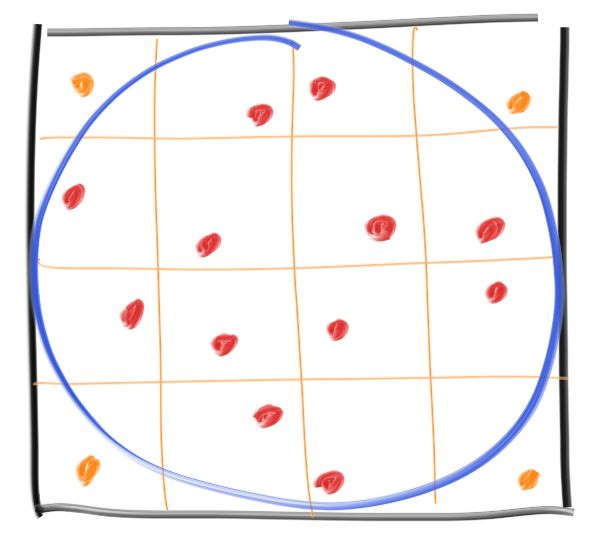
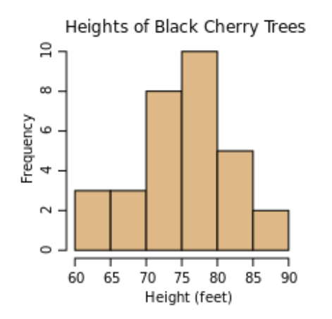
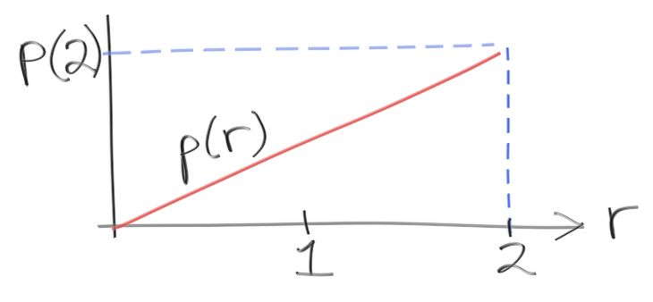

# Ray Tracing The Rest Of Your Life

https://raytracing.github.io/books/RayTracingTheRestOfYourLife.html


## 1. 概述

略。

## 2. 蒙特卡洛程序

首先从一个最简单的蒙特卡洛（Monte Carlo）程序开始。

蒙特卡洛程序给定了一个答案的统计学估计，这个估计随着程序跑的时间越久越准。

这个方法的特点是程序简单，但也伴随着噪声，适合不需要高精确度的图形应用程序。

### 2.1 评估Pi

假设要正方形里有一个圆：


在正方形内选择多个随机点，最终在圆内的那些随机点的占比应该与圆在正方形的占比一致，这个确切的比率应该是圆面积与正方形的区域比值：$\frac{\pi r^2}{(2r)^2}=\frac{\pi}{4}$

由于这里$r$被约去，因此可以随便选一个方便计算的半径，这里令$r=1$，中心在原点。

`pi.cpp`

```c++
#include "rtweekend.h"

#include <iostream>
#include <iomanip>
#include <math.h>
#include <stdlib.h>

int main() {
    int N = 1000;
    int inside_circle = 0;
    for (int i = 0; i < N; i++) {
        auto x = random_double(-1, 1);
        auto y = random_double(-1, 1);
        if (x * x + y * y < 1) inside_circle++;
    }
    std::cout << std::fixed << std::setprecision(12);
    std::cout << "Estimate of Pi = " << 4 * double(inside_circle) / N << '\n';
}
```

### 2.2 寻找收敛点

如果将程序一直跑着，然后打印运行时的评估结果：

`pi.cpp`

```c++
#include "rtweekend.h"

#include <iostream>
#include <iomanip>
#include <math.h>
#include <stdlib.h>

int main() {
    int inside_circle = 0;
    int runs = 0;
    std::cout << std::fixed << std::setprecision(12);
    while (true) {
        runs++;
        auto x = random_double(-1, 1);
        auto y = random_double(-1, 1);
        if (x * x + y * y < 1) inside_circle++;

        if (runs % 100000 == 0)
            std::cout << "Estimate of Pi = "
                      << 4 * double(inside_circle) / runs
                      << '\n';
    }
}
```

越到后面，$\pi$的值估计变化越小。

### 2.3 分层样本（抖动）

我们可以很快接近$\pi$，这是收益递减定律的一个例子，每个样本的收益都小于前一个样本。

>收益递减：例如样本数为100000估计的$\pi$值与样本数1000000000估计的$\pi$值差别不大。

可以通过对样本进行分层（通常称为抖动）来缓解这种递减收益，这里不是随机抽取样本，而是取一个网格，在每个网格中抽取一个样本：



这改变了样本生成，但是我们需要提前知道选择了多少个样本，因为我们需要知道网格。

以1亿为例，两种方法都尝试一下：

`pi.cpp`

```c++
#include "rtweekend.h"

#include <iostream>
#include <iomanip>

int main() {
    int inside_circle = 0;
    int inside_circle_stratified = 0;
    int sqrt_N = 10000;
    for (int i = 0; i < sqrt_N; i++) {
        for (int j = 0; j < sqrt_N; j++) {
            auto x = random_double(-1, 1);
            auto y = random_double(-1, 1);
            if (x * x + y * y < 1) inside_circle++;
            x = 2 * ((i + random_double()) / sqrt_N) - 1;
            y = 2 * ((j + random_double()) / sqrt_N) - 1;
            if (x * x + y * y < 1) inside_circle_stratified++;
        }
    }

    auto N = static_cast<double>(sqrt_N) * sqrt_N;
    std::cout << std::fixed << std::setprecision(12);
    std::cout
        << "Regular    Estimate of Pi = "
        << 4 * double(inside_circle) / (sqrt_N * sqrt_N) << '\n'
        << "Stratified Estimate of Pi = "
        << 4 * double(inside_circle_stratified) / (sqrt_N * sqrt_N) << '\n';
}
```

计算得到：

- **普通：**Estimate of Pi = 3.14151480
- **分层：**Estimate of Pi = 3.14158948

从结果来看，分层方法不仅更好，而且具有更好的**渐进收敛率**。

但是这种优势会随着问题的维度增加而减少（例如3D球体体积中，差别会更小）——称为：**维度诅咒**。

## 3. 一维MC积分

### 3.1 $x^2$积分

一个经典的积分：$I=\int_0^2 x^2dx$

计算机科学符号形式：$I=area(x^2,0,2)$

也可以写成这样：$I=2\cdot average(x^2,0,2)$

引入MC方法：

`integrate_x_sq.cpp`

```c++
#include "rtweekend.h"

#include <iostream>
#include <iomanip>
#include <math.h>
#include <stdlib.h>

int main() {
    int N = 1000000;
    auto sum = 0.0;
    for (int i = 0; i < N; i++) {
        auto x = random_double(0, 2);
        sum += x * x;
    }
    std::cout << std::fixed << std::setprecision(12);
    std::cout << "I = " << 2 * sum / N << '\n';
}

// 估算值 I = 2.666219812257
```

这与预期的差不多，得到了与解析解（$I=\frac{8}{3}$）近似的答案。

MC方法，对于不能积分的函数也可以这样做，例如：$\log(\sin(x))$

图形学中，经常有无法显式写出来的函数，或者只能按照概率求值的函数。

例如在光线追踪`ray_color()`函数的功能，不知道每个方向上看到什么颜色，但是可以在任何给定的维度预估统计。

前面两本书中写的随机程序一个问题是，小光源会产生过多的噪声，这是因为之前采用的是均匀采样，没有对光源进行足够高频率的采样。

弹射的光线对空间中所有方向是一视同仁的发射光线，所有方向的权重是一样的，没有差别。

例如：`random_double(0, 2)`函数在区间`(0,2)`区间内均匀采样。

```c++
int main()
{
    double d = random_double(0, 1);
    
    int total_N = 10000;
    int less_N = 0;
    for (int i = 0; i < total_N; ++i)
    {
        d = random_double(0, 1);
        if(d < 0.25) ++less_N;
    }
    
    std::cout << "less_p = " << (double)less_N / (double)total_N << '\n';
}

// less_p = 0.2507
```

以上代码就是均匀采样的结果，随机值$d$在`(0,1)`区间内采样，值小于$0.25$的概率是$0.2507$

只有当光线向光源散射时，才会对光源进行采样，但对于较小的光或距离较远的光源来说，散射的光线很难采样到光源。

如果我们向这个光源发送更多的随机光线样本，可以减轻这个问题，但这会导致场景的亮度不准确。

可以通过改变样本的权重，调整过度采样，从而消除这种不确定性。

我们如何进行调整？要做到这一点，我们需要概率密度函数的概念。

### 3.2 概率密度函数

概率密度函数是直方图的连续形式：



如果为更多的树添加数据，则直方图会变得更高，如果把数据分成更多的块，则就会变短。

**离散密度函数**与直方图不同，它将频率$y$轴归一化为一个分数或百分比。

如果把分块的数量取到无穷大，则可以得到一个连续的直方图，所有的分块高度会降为0。

密度函数是指我们对分块进行调整，使得它们不会随着分块数的增加而变短。

对于上面的树直方图，可以得到式子：$bin-height=\frac{(Fraction\quad of\quad trees\quad between\quad height\quad H\quad and\quad H')}{(H-H')}$

可以将其解释为一棵树高度的统计预测指标：

$Probability\quad a\quad random\quad tree\quad is\quad between\quad H\quad and\quad H'=bin-height\cdot(H-H')$

如果想要知道在多个分块张成的空间里的概率，需要求和。

概率密度函数（即PDF），是使分数直方图连续的。

### 3.3 构建一个PDF

构建一个**概率密度函数**（Probability density function，PDF）同时使用它来加深理解。

假设要一个`[0,2]`之间的随机数$r$，其概率与自身成正比，随机值越大则概率值越大。

我们期待$p(r)$与下图相似，则它的高度有多少：



高度就是$p(2)$，与直方图类似，可以对区域求和（积分）来计算出$r$在区间$(x_0,x_1)$内的概率：

$Probability(x_0<r<x_1)=C\cdot area(p(r), x_0, x_1)$

其中$C$是缩放常数（这里指直线的斜率），又因为概率$r$在全区间内的和为$1$，因此：$area(p(r), 0, 2)=1$

因为$p(r)$与$r$成正比，假设$p=C'\cdot r$，对于其他常数：

$area(C'r,0,2)=\int_0^2C'rdr=\frac{C'r^2}{2}|_{r=0}^{r=2}=\frac{C'\cdot 2^2}{2}-\frac{C'\cdot 0^2}{2}=2C'$

因此，这里的概率密度函数为：$p(r)=\frac{r}{2}$

如何用这个**概率密度函数**$p(r)$生成一个随机数？或者说，如何获得一个符合概率密度函数$p(r)$的随机数。

这个非均匀分布的随机数才是我们真正关心的。

给定一个均匀且介于`[0,1]`之间的随机数`d=random_double()`，需要找到一些函数$f(d)$，从而满足想要的结果：

假设$e=f(d)=d^2$，这不再是一个均匀分布的概率密度函数，$e$的概率密度在靠近$1$时会比靠近$0$时更大。为了将这个一般的观察结果转化为一个函数，需要**累积概率分布函数**（Cumulative Probability distribution function）：$P(x)=area(p,-\infty,x)$

以这个**概率密度函数**为例：$p(r)=\frac{r}{2}$，则累积分布$P(x)$就是：

- $P(x)=0,\qquad x<0$
- $P(x)=\frac{x^2}{4},\qquad 0<x<2$
- $P(x)=1,\qquad x>2$

如果在$x=1.0$处求$P$值，则得到：$P(1.0)=\frac{1}{4}$

这表示，由这个PDF描述的随机变量的值，小于1的概率是25%。

我们想要一个函数`f()`，当我们调用`f(random_double())`，我们会得到一个概率密度函数为$\frac{x^2}{4}$的返回值。

我们希望以一个均匀的随机值`random_double()`作为函数的输入，获得一个非均匀的随机数作为返回值。

我们不知道这个函数的样子，但是知道这个函数的返回值有25%的概率小于1.0，75%的概率大于1.0

如果`f()`单调递增，则期望$f(0.25)=1.0$，这里可以概括为`f()`对于每一个可能的输入：$f(P(x))=x$

这意味着函数$f$只是撤销函数$P$所做的任何事情，当$x=1.0$，$P(x)=0.25$，$f(x)=1.0$，所以：

$f(x)=P^{-1}(x)$

如果有**概率密度函数$p()$和累计分布函数$P()$**，可以使用**逆函数**与一个随机数来得到想要的：

`e=P^{-1}(random_double())`

对于$p(x)=\frac{x}{2}$，以及相应的$P(x)$，需要计算$P$的反函数，如果有：$y=\frac{x^2}{4}$

通过用$y$求出$x$来求反函数：$x=\sqrt{4y}$，得到满足概率密度$p$的随机变量`e = sqrt(4 * random_double())`

注意，这个范围从$0$到$2$，如果用$\frac{1}{4}$替换`random_double()`，会得到预期的$1$

验证$e$的概率：

```c++
int main() {
    double e = 0.0;
    
    int total_N = 100000;
    int less_N = 0;
    for (int i = 0; i < total_N; ++i)
    {
        e = 0.5 * sqrt(4.0 * random_double(0, 1));
        if(e < 0.25) ++less_N;
    }
    
    std::cout << "less_p = " << (double)less_N / (double)total_N << '\n'; 
}

// less_p = 0.06229
```

`random_double()`生成的随机变量$d$在$(0,1)$区间上取值小于0.25的概率是0.25左右，而新的随机变量$e$在$(0,1)$区间上取值小于0.25的概率编程了0.06229，新的随机变量$e$是非均匀的。

现在可以对之前的积分进行采样：$I=\int^2_0 x^2$

需要考虑$x$的PDF分布的不均匀性，在采样过多的地方，应该降低权重。

PDF可以完美地衡量采样的多少，所以权重函数应该与 $1/pdf$ 成比，实际上它就是$1/pdf$

```c++
inline double pdf(double x) {
    return 0.5 * x;
}

int main() {
    int N = 1000000;
    auto sum = 0.0;
    for(int i = 0; i < N; i++) {        
        auto x = sqrt(random_double(0, 4));
        sum += x * x / pdf(x);
    }
    std::cout << std::fixed << std::setprecision(12);
    std::cout << "I = " << sum / N << '\n';
}

//sum += x * x / pdf(x) 的情况下 I = 2.666933546195
//sum += x * x          的情况下 I = 2.000120238310
```

### 3.4 重要性采样

由于在被积函数值较大的地方进行更多采样，期望更少的噪声，从而更快地收敛。

实际上，我们正在将样本转向分布更重要的部分，这就是为什么使用精心选择的非均匀PDF通常被称为重要性采样。

如果我们使用均匀采样相同代码，那么在`[0,2]`范围内的$PDF=1/2$，可以获得`x=random_double(0,2)`

```c++
inline double pdf(double x) {
    return 0.5;
}

int main() {
    int N = 1000000;
    auto sum = 0.0;
    for (int i = 0; i < N; i++) {        
        auto x = random_double(0, 2);
        sum += x * x / pdf(x);
    }
    std::cout << std::fixed << std::setprecision(12);
    std::cout << "I = " << sum / N << '\n';
}
// I = 2.666219812257
```

注意到我们不再需要$2*sum/N$中的$2$，它已经由PDF处理，当你除以它的时候，它是$2$。

从上面注意到，重要性采样有一些作用，但是作用不大。

我们可以让PDF完全遵循被积函数：$p(x)=\frac{3}{8}x^2$

相应地可以得到：$P(x)=\frac{x^3}{8}$，$P^{-1}(x)=8x^{\frac{1}{3}}$

完美的重要性采样只有在我们已经知道答案时才有可能，通过整合$p$分析得到$P$，但这是确保我们代码正常工作的一个很好的练习。

对于一个仅有的样本，我们得到：

```c++
inline double pdf(double x) {
    return 3 * x * x / 8;
}

int main() {
    int N = 1;
    auto sum = 0.0;
    for (int i = 0; i < N; i++) {
        auto x = pow(random_double(0, 8), 1./3.);
        sum += x * x / pdf(x);
    }
    std::cout << std::fixed << std::setprecision(12);
    std::cout << "I = " << sum / N << '\n';
}
```

它总是返回准确的答案。

回顾一下蒙特卡洛光线追踪器的基本概念：

- 有一个$f(x)$在某个定义域$[a,b]$上的积分。
- 选择一个非$0$区域$[a,b]$的PDF(p)
- 平均$\frac{f(r)}{p(r)}$，其中$r$是PDF(p)的一个随机数

PDF的任何选择p总是会收敛到正确的答案，但越接近p的近似值f，收敛地越快。


